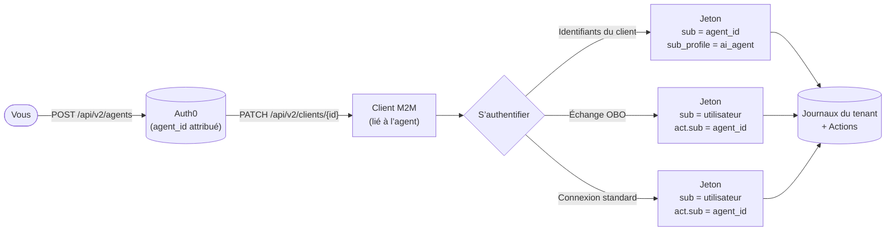

import { ReleaseStageNotice } from "/snippets/fr-ca/ReleaseStageNotice.jsx"

<ReleaseStageNotice feature="Agents en tant qu’identité principale" stage="ea" contact="Auth0 Support" terms="true" />

La fonctionnalité Agents en tant qu’identité principale introduit les agents d’IA comme identités de premier plan dans Auth0, distinctes des utilisateurs humains et des clients traditionnels de machine à machine (M2M). Un agent est une entité enregistrée dotée d’un identifiant stable, de son propre cycle de vie, de ses propres identifiants et de sa propre piste d’audit.

Une fois enregistré comme principal Auth0, un agent peut :

* Agir au nom de l’utilisateur
* Fonctionner de façon autonome sans session utilisateur
* Participer à une délégation à plusieurs niveaux par échange de jetons

  ## Cas d’utilisation

* Agents autonomes : Un agent d’IA utilise les identifiants client pour appeler directement des API en son propre nom, son identité étant consignée dans les journaux et les jetons.
* Accès délégué : Un utilisateur autorise un agent d’IA à agir en son nom. L’agent échange le jeton d’accès de l’utilisateur contre un jeton délégué qui conserve l’utilisateur comme sujet et identifie l’agent comme acteur.
* Chaînes à plusieurs niveaux : Un agent orchestrateur délègue des tâches à un sous-agent. La chaîne de délégation est préservée dans des revendications `act` imbriquées, ce qui permet une traçabilité complète sur n’importe quel serveur de ressources.

  ## Fonctionnement

Agents en tant qu’identité principale fonctionne en trois étapes : l’enregistrement, l’association des clients et l’émission de jetons.

1. [Enregistrez l’agent](/docs/fr-ca/ai-agents-mcp/agents-as-principal/register-an-agent) : Vous enregistrez un agent dans Auth0 à l’aide du Dashboard ou de la Management API. Auth0 crée un [objet agent](/docs/fr-ca/ai-agents-mcp/agents-as-principal/register-an-agent#agent-object) avec un `agent_id` stable, traçable dans les jetons, les journaux et la Management API tout au long de son cycle de vie.

2. [Associez l’agent à un client](/docs/fr-ca/ai-agents-mcp/agents-as-principal/associate-agent-client) : Un agent ne possède pas ses propres identifiants d’authentification ; il s’authentifie par l’intermédiaire d’un ou de plusieurs clients associés. Un agent peut être lié à plusieurs clients, ce qui est utile pour utiliser des clients distincts selon l’environnement ou la région tout en conservant une seule identité logique dans les journaux.

3. [Identité de l’agent dans les jetons](/docs/fr-ca/ai-agents-mcp/agents-as-principal/agent-identity-in-tokens) : Lorsqu’un client lié à un agent s’authentifie, Auth0 intègre l’identité de l’agent au jeton émis selon le type d’autorisation.

L’`agent_id` (ou l’`external_agent_id`, s’il est défini lors de la création) est également consigné dans les [journaux du tenant](/docs/fr-ca/ai-agents-mcp/agents-as-principal/tenant-logs) à chaque émission de jeton, ce qui vous fournit une piste d’audit complète pour chaque agent. Vous pouvez aussi accéder à l’identité de l’agent dans les [Actions](/docs/fr-ca/ai-agents-mcp/agents-as-principal/actions-context) au moyen de `event.agent` afin d’appliquer une logique personnalisée lors de l’émission du jeton.

  ## Conseils de migration

Migrez vos clients et serveurs de ressources existants afin qu’ils utilisent Agents en tant qu’identité principale.

  ### Clients

Les clients existants ne sont pas touchés, sauf si vous les associez explicitement à un agent. L’association d’un agent est facultative et réversible. Pour en savoir plus, consultez [Associer un agent à un client](/docs/fr-ca/ai-agents-mcp/agents-as-principal/associate-agent-client).

  ### Serveurs de ressources

Pour recevoir les claims `sub_profile` et `client_profile`, définissez `agent_subject_claims: 'auth0-v1'` dans la configuration du serveur de ressources cible. Cette option doit être activée pour chaque serveur de ressources. Pour en savoir plus, consultez [Configurer un serveur de ressources pour recevoir les claims de sujet d’agent](/docs/fr-ca/ai-agents-mcp/agents-as-principal/agent-identity-in-tokens#configure-resource-server-to-receive-agent-subject-claims).