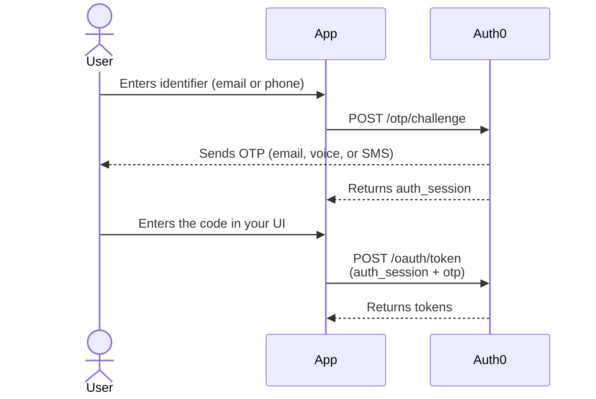

import { ReleaseStageNotice } from "/snippets/fr-ca/ReleaseStageNotice.jsx"

<ReleaseStageNotice feature="Authentification sans mot de passe sur les connexions de base de données avec l’API d’authentification Auth0" stage="ea" contact="support" terms="true" />

Les applications natives et dorsales dotées d’une interface de connexion personnalisée peuvent authentifier les utilisateurs au moyen d’un mot de passe à usage unique (OTP) envoyé par courriel ou par téléphone directement par l’API d’authentification Auth0, sans redirection vers Universal Login. Cette fonctionnalité prend en charge les OTP par courriel, par SMS et par appel vocal sur les connexions de base de données standard.

Vous pouvez ainsi utiliser l’authentification par code à usage unique à partir de la même connexion de base de données qui contient déjà vos utilisateurs. Si vous utilisiez auparavant `/passwordless/start` avec une connexion Passwordless dédiée, vous pouvez plutôt utiliser votre connexion de base de données existante. Pour utiliser l’authentification sans mot de passe avec Universal Login, consultez [Authentification sans mot de passe sur les connexions de base de données](/docs/fr-ca/authenticate/database-connections/passwordless-authentication-for-db-connect).

<Callout icon="file-lines" color="#0EA5E9" iconType="regular">
  L’autorisation Passwordless OTP n’est pas offerte pour les applications de type application monopage (SPA). Si votre interface utilisateur est une application monopage, effectuez les requêtes `/otp/challenge` et `/oauth/token` à partir d’une application dorsale pour laquelle l’autorisation Passwordless OTP est activée.
</Callout>

L’authentification se fait en deux requêtes :

1. `POST /otp/challenge` — envoyer un code à usage unique au courriel ou au téléphone de l’utilisateur.
2. `POST /oauth/token` — échanger le code saisi par l’utilisateur contre des jetons.

<div id="how-it-works">
  ## Comment ça fonctionne
</div>



1. L’utilisateur saisit une adresse courriel ou un numéro de téléphone dans votre application.
2. Votre application appelle le point de terminaison [`POST /otp/challenge`](/docs/fr-ca/api/authentication/passwordless/get-code-or-link).
3. Le serveur d’autorisation Auth0 envoie un code à usage unique à l’adresse courriel ou au numéro de téléphone de l’utilisateur.
4. Le serveur d’autorisation Auth0 renvoie une valeur `auth_session`. Stockez cette valeur : aucun autre état n’est requis.
5. L’utilisateur reçoit le code et le saisit dans l’interface utilisateur de votre application.
6. Votre application appelle le point de terminaison [`POST /oauth/token`](/docs/fr-ca/api/authentication/passwordless/get-token) avec `auth_session` et le code saisi par l’utilisateur.
7. Le serveur d’autorisation Auth0 vérifie le code associé à `auth_session` et renvoie un jeton d’ID et un jeton d’accès (et, facultativement, un jeton d’actualisation).

Le flux est sans état du point de vue de votre application. La seule valeur que vous transmettez entre les deux requêtes est la chaîne `auth_session` renvoyée à l’étape 4. Auth0 détermine si la requête concerne une connexion ou une inscription, et si l’AMF est requise : vous n’avez pas à gérer cela vous-même. Pour en savoir plus, consultez [Comment Auth0 détermine s’il s’agit d’une connexion ou d’une inscription](#how-auth0-determines-login-vs-signup).

<Card title="Avant de commencer">
  * Configurez `email_otp` et/ou `phone_otp` comme méthodes d’authentification dans votre connexion de base de données. Pour en savoir plus, consultez [Passwordless Authentication on Database Connections](/docs/fr-ca/authenticate/database-connections/passwordless-authentication-for-db-connect).
  * Activez la vérification OTP pour les inscriptions si vous souhaitez que les utilisateurs s’inscrivent au moyen du flux d’inscription implicite. Pour en savoir plus, consultez [Passwordless Authentication on Database Connections](/docs/fr-ca/authenticate/database-connections/passwordless-authentication-for-db-connect).
  * Activez le type d’octroi Passwordless OTP dans Auth0 Dashboard ou l’API Management. Pour en savoir plus, consultez [Mettre à jour les types d’octroi](/docs/fr-ca/get-started/applications/update-grant-types).
  * Les applications confidentielles, telles que les applications Web dorsales, doivent envoyer `client_secret` dans les deux requêtes. Les clients publics, tels que les applications natives, n’ont pas à le faire.
  * Pour l’OTP vocal, activez [Unified Phone Experience](/docs/fr-ca/customize/phone-messages/unified-phone/configure-unified-phone) afin de pouvoir utiliser la voix comme canal de transmission.
</Card>

<div id="initiate-the-otp-challenge">
  ## Initier la demande d’OTP
</div>

Envoyez l’identifiant de l’utilisateur. Auth0 génère et transmet le code, puis renvoie une `auth_session` opaque.

```bash lines
curl --request POST \
  --url 'https://YOUR_DOMAIN/otp/challenge' \
  --header 'Content-Type: application/json' \
  --data '{
    "connection": "YOUR_CONNECTION_NAME",
    "client_id": "YOUR_CLIENT_ID",
    "email": "user@example.com"
  }'
```

<div id="parameters">
  ### Paramètres
</div>

| Paramètre         | Obligatoire  | Description                                                                                                                                                                                                                              |
| ----------------- | ------------ | ---------------------------------------------------------------------------------------------------------------------------------------------------------------------------------------------------------------------------------------- |
| `connection`      | Oui          | Nom de la connexion à la base de données où Email OTP et/ou Phone OTP sont configurés.                                                                                                                                                   |
| `client_id`       | Oui          | Le Client ID de votre application.                                                                                                                                                                                                       |
| `email`           | Conditionnel | L’adresse courriel de l’utilisateur. Indiquez `email` ou `phone_number`, mais pas les deux.                                                                                                                                              |
| `phone_number`    | Conditionnel | Le numéro de téléphone de l’utilisateur au format [E.164](https://en.wikipedia.org/wiki/E.164), y compris l’indicatif du pays (par exemple, `+15555550123`). Indiquez `email` ou `phone_number`, mais pas les deux.                      |
| `client_secret`   | Conditionnel | Obligatoire pour les [applications confidentielles](/docs/fr-ca/get-started/applications/confidential-and-public-applications).                                                                                                                |
| `allow_signup`    | Non          | Lorsque la valeur est `true`, Auth0 crée l’utilisateur s’il n’existe pas et que l’inscription est activée pour la connexion. La valeur par défaut est `false`. Pour en savoir plus, consultez [Inscription implicite](#implicit-signup). |
| `delivery_method` | Non          | Pour l’envoi par téléphone, choisissez `text` ou `voice` lorsque les deux options sont activées pour la connexion.                                                                                                                       |

Le nom du champ (`email` ou `phone_number`) indique à Auth0 quel canal utiliser. Il n’est pas nécessaire d’envoyer un `type` d’identifiant distinct.

<div id="response">
  ### Réponse
</div>

```json lines
HTTP/1.1 200 OK
Content-Type: application/json

{
  "auth_session": "507f1f77bcf86cd799439011"
}
```

`/otp/challenge` renvoie `200 OK` que l’utilisateur existe ou non. Cela empêche l’énumération des utilisateurs. Un pirate ne peut pas utiliser l’endpoint pour déterminer quels identifiants sont associés à des comptes. Traitez `auth_session` comme une chaîne opaque : stockez-la et transmettez-la telle quelle lors de la requête suivante.

<div id="exchange-the-code-for-tokens">
  ## Échangez le code contre des jetons
</div>

Lorsque l’utilisateur saisit le code, envoyez-le avec l’`auth_session` de la requête précédente.

```bash lines
curl --request POST \
  --url 'https://YOUR_DOMAIN/oauth/token' \
  --header 'Content-Type: application/json' \
  --data '{
    "grant_type": "http://auth0.com/oauth/grant-type/passwordless/otp",
    "client_id": "YOUR_CLIENT_ID",
    "auth_session": "507f1f77bcf86cd799439011",
    "otp": "123456",
    "scope": "openid profile email"
  }'
```

<div id="parameters">
  ### Paramètres
</div>

| Paramètre       | Obligatoire  | Description                                                                               |
| --------------- | ------------ | ----------------------------------------------------------------------------------------- |
| `grant_type`    | Oui          | Doit être `http://auth0.com/oauth/grant-type/passwordless/otp`.                           |
| `client_id`     | Oui          | Le Client ID de votre application.                                                        |
| `auth_session`  | Oui          | La valeur opaque renvoyée par `POST /otp/challenge`.                                      |
| `otp`           | Oui          | Le mot de passe à usage unique saisi par l’utilisateur.                                   |
| `client_secret` | Conditionnel | Obligatoire pour les applications confidentielles.                                        |
| `scope`         | Non          | Liste des scopes demandés, séparés par des espaces. Par exemple : `openid profile email`. |

<div id="response">
  ### Réponse
</div>

```json lines
HTTP/1.1 200 OK
Content-Type: application/json

{
  "access_token": "eyJ...",
  "id_token": "eyJ...",
  "token_type": "Bearer",
  "expires_in": 86400
}
```

<div id="implicit-signup">
  ## Inscription implicite
</div>

Par défaut, l’Authentication API authentifie uniquement les utilisateurs existants lorsque `allow_signup: false`. Vous pouvez transmettre `allow_signup: true` à `POST /otp/challenge` pour qu’une vérification OTP réussie crée le compte si l’utilisateur n’existe pas encore et que l’inscription est activée pour la connexion.

* `allow_signup: false` : Auth0 ne crée jamais d’utilisateur. Les identifiants inconnus échouent lors de l’échange de jetons.
* `allow_signup: true` : Si l’utilisateur n’existe pas et que la connexion autorise l’inscription, le compte est créé lors de la vérification de l’OTP et les jetons sont émis à la même étape.

Pour que l’inscription implicite réussisse, la connexion doit exiger un seul identifiant ou rendre tous les identifiants facultatifs. Pour en savoir plus, consultez [Implicit Signup and Login for Passwordless Database Connections](/docs/fr-ca/authenticate/database-connections/implicit-signup-database-connections).

<div id="how-auth0-determines-login-vs-signup">
  ## Comment Auth0 distingue la connexion de l’inscription
</div>

Votre application effectue toujours les deux mêmes requêtes, que l’utilisateur soit nouveau ou revienne. Auth0 détermine l’intention au moment du challenge et l’enregistre côté serveur dans `auth_session`. Lors de l’échange de jetons, Auth0 recherche la session et effectue l’action appropriée.

| Situation à `/otp/challenge`                                       | Résultat à `/oauth/token` (avec le bon OTP)                              |
| ------------------------------------------------------------------ | ------------------------------------------------------------------------ |
| L’utilisateur existe                                               | Lors de la connexion, Auth0 émet des jetons pour l’utilisateur existant. |
| Utilisateur introuvable, `allow_signup: true`, inscription activée | Lors de l’inscription, Auth0 crée un compte et émet des jetons.          |

<Callout icon="file-lines" color="#0EA5E9" iconType="regular">
  Par conception, le cas d’un compte bloqué renvoie la même erreur qu’un OTP incorrect afin que la réponse ne révèle jamais si un compte existe.
</Callout>

<div id="multi-factor-authentication">
  ## Authentification multifacteur
</div>

Si vous exigez l’AMF, `POST /oauth/token` renvoie une erreur `mfa_required` avec le code `403` :

```json lines
HTTP/1.1 403 Forbidden
Content-Type: application/json

{
  "error": "mfa_required",
  "mfa_token": "eyJ...",
  "mfa_requirements": {
    "challenge_types": ["otp", "oob"]
  }
}
```

Utilisez le `mfa_token` pour envoyer une requête à l’[API MFA](/docs/fr-ca/secure/multi-factor-authentication/multi-factor-authentication-developer-resources/mfa-api) afin de soumettre une demande de vérification et de vérifier le facteur supplémentaire. Ce processus est conforme au fonctionnement de la MFA pour tous les autres types d’autorisation Auth0.

<div id="error-responses">
  ## Réponses d’erreur
</div>

Les deux endpoints utilisent le format d’erreur OAuth 2.0 défini dans la [RFC 6749](https://datatracker.ietf.org/doc/html/rfc6749#section-5.2) : un code `error` et une `error_description` lisible par l’utilisateur. Les échecs de validation des paramètres (`400`) comprennent également un tableau `validation_errors` qui indique les champs concernés.

```json lines
{
  "error": "invalid_request",
  "error_description": "Either email or phone_number must be provided",
  "validation_errors": [
    { "field": "email", "message": "Either email or phone_number must be provided" }
  ]
}
```

<div id="post-otpchallenge">
  ### POST /otp/challenge
</div>

| Statut HTTP | `error`               | Cas d’occurrence                                                                                                                           |
| ----------- | --------------------- | ------------------------------------------------------------------------------------------------------------------------------------------ |
| 400         | `invalid_request`     | `connection` ou `client_id` manquant, aucun identifiant fourni, ou adresse courriel ou numéro de téléphone mal formé.                      |
| 400         | `invalid_connection`  | La connexion n’existe pas, n’est pas une connexion à une base de données ou n’est pas configurée pour l’OTP par courriel ou par téléphone. |
| 401         | `invalid_client`      | Application confidentielle sans `client_secret` ou ayant envoyé un `client_secret` incorrect.                                              |
| 403         | `unauthorized_client` | Le grant Passwordless OTP n’est pas activé pour l’application.                                                                             |
| 429         | `too_many_requests`   | Plus de 50 requêtes par heure provenant d’une même adresse IP.                                                                             |
| 500         | `server_error`        | Erreur interne inattendue.                                                                                                                 |

<div id="post-oauthtoken">
  ### POST /oauth/token
</div>

| Statut HTTP | `error`             | Dans quels cas                                                                                                                                                          |
| ----------- | ------------------- | ----------------------------------------------------------------------------------------------------------------------------------------------------------------------- |
| 400         | `invalid_request`   | `auth_session` invalide, expirée ou déjà utilisée; `otp` ou `client_id` manquant; OTP incorrect ou expiré (également renvoyé pour une intention d’inscription bloquée). |
| 401         | `invalid_client`    | Application confidentielle sans `client_secret` ou ayant envoyé un `client_secret` incorrect.                                                                           |
| 403         | `access_denied`     | Le compte est bloqué par un administrateur ou par la protection contre les attaques par force brute.                                                                    |
| 403         | `mfa_required`      | MFA est requis — la réponse comprend `mfa_token` et `mfa_requirements`.                                                                                                 |
| 429         | `too_many_requests` | Dépassement des limites de débit globales du point de terminaison de jetons.                                                                                            |
| 500         | `server_error`      | Erreur interne inattendue.                                                                                                                                              |

<div id="rate-limits">
  ## Limites de débit
</div>

`POST /otp/challenge` est limité à 50 requêtes par heure et par adresse IP, en plus des [limites de débit globales de l’Authentication API](/docs/fr-ca/troubleshoot/customer-support/operational-policies/rate-limit-policy). Tout dépassement de cette limite renvoie `429 Too Many Requests`.

Les réponses soumises à une limite de débit comprennent les en-têtes suivants :

| En-tête                 | Description                                                              |
| ----------------------- | ------------------------------------------------------------------------ |
| `X-RateLimit-Limit`     | Limite de requêtes configurée pour la période.                           |
| `X-RateLimit-Remaining` | Nombre de requêtes restantes dans la période en cours.                   |
| `X-RateLimit-Reset`     | Horodatage Unix auquel la période est réinitialisée.                     |
| `Retry-After`           | Nombre de secondes avant de pouvoir réessayer (dans les réponses `429`). |

<div id="limitations">
  ## Limites
</div>

* Les applications monopages (SPA) ne peuvent pas utiliser ces endpoints directement, car le grant Passwordless OTP ne peut pas être activé pour les applications de type SPA. Faites transiter les requêtes par une application côté serveur pour laquelle ce grant est activé.
* Les applications confidentielles doivent envoyer `client_secret` dans les deux requêtes.
* Authentication API authentifie les utilisateurs à l’aide de connexions de base de données configurées avec un OTP par courriel ou par téléphone. Elle ne remplace pas `/passwordless/start` pour les connexions passwordless dédiées par courriel ou SMS.

<div id="learn-more">
  ## En savoir plus
</div>

* [Authentification sans mot de passe avec des connexions de base de données](/docs/fr-ca/authenticate/database-connections/passwordless-authentication-for-db-connect)
* [Inscription et connexion implicites pour les connexions de base de données sans mot de passe](/docs/fr-ca/authenticate/database-connections/implicit-signup-database-connections)
* [Authentification multifacteur avec l’API d’authentification](/docs/fr-ca/secure/multi-factor-authentication/authenticate-using-ropg-flow-with-mfa)
* [Limites de débit de l’API d’authentification](/docs/fr-ca/troubleshoot/customer-support/operational-policies/rate-limit-policy)