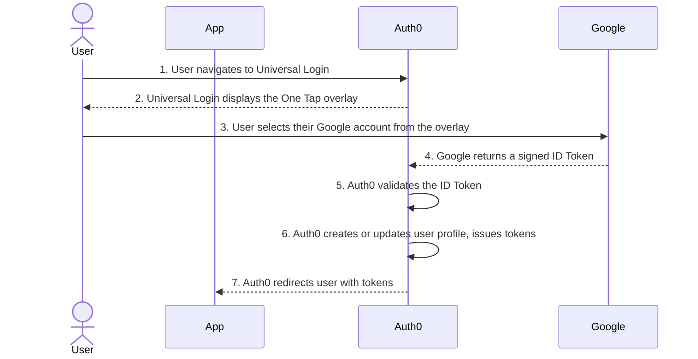

import { ReleaseStageNotice } from "/snippets/fr-ca/ReleaseStageNotice.jsx"

<ReleaseStageNotice feature="Google One Tap" stage="ea" terms="true" />

Auth0 prend en charge l’authentification des utilisateurs avec [Google One Tap](https://developers.google.com/identity/gsi/web/guides/overview) dans [Universal Login](/docs/fr-ca/authenticate/login/auth0-universal-login/universal-login-vs-classic-login/universal-experience). Google One Tap permet aux utilisateurs de se connecter ou de s’inscrire d’un seul toucher en utilisant une session Google active dans leur navigateur, sans quitter votre page Universal Login. Lorsqu’un utilisateur ayant un compte Google actif visite votre page de connexion, le prompt Google One Tap s’affiche en superposition avec le compte actif de l’utilisateur. L’utilisateur le sélectionne, puis Auth0 valide les identifiants et crée une session. Aucune redirection vers Google n’est nécessaire.

<div id="how-it-works">
  ## Fonctionnement
</div>

Google One Tap utilise l’[API Federated Credential Management (FedCM)](https://developer.chrome.com/docs/identity/fedcm/overview), une norme d’authentification intégrée au navigateur qui ne dépend ni des cookies tiers ni des redirections de page.



1. Un utilisateur accède à votre page Universal Login alors qu’une session Google est active dans son navigateur.
2. Universal Login détecte la session Google active et affiche la superposition Google One Tap.
3. L’utilisateur sélectionne son compte Google dans le prompt.
4. Google renvoie un jeton d’ID signé à Universal Login.
5. Auth0 valide le jeton d’ID auprès de la connexion sociale Google configurée pour votre tenant.
6. Auth0 crée ou met à jour le profil utilisateur et émet des jetons Auth0.
7. Auth0 redirige l’utilisateur vers votre application.

Si le navigateur de l’utilisateur ne prend pas en charge FedCM ou si l’utilisateur ferme le prompt, l’option standard **Poursuivre avec Google** reste disponible sur la page de connexion. Si l’utilisateur ferme le prompt, Google applique un [délai exponentiel](https://developers.google.com/identity/gsi/web/guides/features#exponential_cooldown) chaque fois que l’utilisateur ferme One Tap.

<Card title="Avant de commencer">
  * Vous devez activer et configurer Universal Login pour votre tenant. Google One Tap n’est pas pris en charge par l’expérience Classic Login. Pour en savoir plus, consultez [Universal Login vs. Classic Login](/docs/fr-ca/authenticate/login/auth0-universal-login/universal-login-vs-classic-login).
  * Vous devez créer et configurer une connexion sociale Google (`google-oauth2`) dans votre tenant. Pour en savoir plus, consultez [Ajouter Google Login à votre application](/docs/fr-ca/authenticate/identity-providers/social-identity-providers/google).
</Card>

<div id="enable-google-one-tap">
  ## Activer Google One Tap
</div>

Activez Google One Tap pour chaque application à l’aide de l’Auth0 Dashboard, de la Management API ou d’un Auth0 SDK.

<Callout icon="file-lines" color="#0EA5E9" iconType="regular">
  L’intégration Google One Tap d’Auth0 ne prend pas en charge [Token Vault](/docs/fr-ca/secure/call-apis-on-users-behalf/token-vault#token-vault) ni [Connected Accounts for Token Vault](/docs/fr-ca/secure/call-apis-on-users-behalf/token-vault/connected-accounts-for-token-vault). Si vous activez Google One Tap alors que Token Vault est activé, le prompt Google One Tap ne s’affiche pas.
</Callout>

<Tabs>
  <Tab title="Auth0 Dashboard">
    1. Accédez à [Auth0 Dashboard &gt; Applications](https://manage.auth0.com/#/applications).
    2. [Créez une application](/docs/fr-ca/get-started/auth0-overview/create-applications) ou sélectionnez une application existante à utiliser avec Google One Tap.
    3. Dans Settings, recherchez Social Login et activez **Allow Google One Tap**.
       <Frame></Frame>
    4. Sélectionnez **Save**.
    5. Accédez à [Auth0 Dashboard &gt; Authentication &gt; Social](https://manage.auth0.com/#/connections/social).
    6. Créez une connexion sociale Google ou sélectionnez votre connexion `google-oauth2` existante.
    7. Dans les paramètres de la connexion :
       * Dans l’onglet Settings, vérifiez votre ID client Google et votre secret client. Vous ne pouvez pas utiliser les [clés de développeur Auth0](/docs/fr-ca/authenticate/identity-providers/social-identity-providers/devkeys) avec l’intégration One Tap.
       * Dans l’onglet Applications, vérifiez que l’application à utiliser avec One Tap est activée.
    8. Sélectionnez **Save**.
  </Tab>

  <Tab title="Management API">
    Appelez le point de terminaison [Update a client](/docs/fr-ca/api/management/v2/clients/patch-clients-by-id) et définissez `fedcm_login.google.is_enabled` sur `true` :

    ```json
    PATCH /api/v2/clients/{id}

    {
      "fedcm_login": {
        "google": {
          "is_enabled": true
        }
      }
    }
    ```

    Pour désactiver Google One Tap pour une application donnée, définissez `is_enabled` sur `false`.
  </Tab>

  <Tab title="SDK Auth0">
    Utilisez les exemples suivants pour ajouter Google One Tap à Universal Login à l’aide d’un SDK Auth0. Pour une expérience optimale, nous vous recommandons d’utiliser la version la plus récente des SDK Auth0.

    <AccordionGroup>
      <Accordion title="C#">
        ```csharp
        using Auth0.ManagementApi;
        using Auth0.ManagementApi.Types;
        using System.Threading.Tasks;

        public partial class Examples
        {
            public async Task Example() {
                var client = new ManagementClient(
                    token: "<token>"
                );

                await client.Clients.UpdateAsync(
                    id: "id",
                    request: new UpdateClientRequestContent {
                        FedcmLogin = new FedCmLoginPatch {
                            Google = new FedCmLoginGooglePatch {
                                IsEnabled = true
                            }
                        }
                    }
                );
            }

        }
        ```
      </Accordion>

      <Accordion title="Go">
        ```go
        package example

        import (
            context "context"

            management "github.com/auth0/go-auth0/management/management"
            client "github.com/auth0/go-auth0/management/management/client"
            option "github.com/auth0/go-auth0/management/management/option"
        )

        func do() {
            client := client.NewClient(
                option.WithToken(
                    "<token>",
                ),
            )
            request := &management.UpdateClientRequestContent{
                FedcmLogin: &management.FedCmLoginPatch{
                    Google: &management.FedCmLoginGooglePatch{
                        IsEnabled: true,
                    },
                },
            }
            client.Clients.Update(
                context.TODO(),
                "id",
                request,
            )
        }
        ```
      </Accordion>

      <Accordion title="Java">
        ```java
        package com.example.usage;

        import com.auth0.client.mgmt.ManagementApi;
        import com.auth0.client.mgmt.resources.clients.requests.UpdateClientRequestContent;
        import com.auth0.client.mgmt.types.FedCmLoginPatch;
        import com.auth0.client.mgmt.types.FedCmLoginGooglePatch;

        public class Example {
            public static void main(String[] args) {
                ManagementApi client = ManagementApi
                    .builder()
                    .token("<token>")
                    .build();

                client.clients().update(
                    "id",
                    UpdateClientRequestContent
                        .builder()
                        .fedcmLogin(
                            FedCmLoginPatch.builder()
                                .google(
                                    FedCmLoginGooglePatch.builder()
                                        .isEnabled(true)
                                        .build()
                                )
                                .build()
                        )
                        .build()
                );
            }
        }
        ```
      </Accordion>

      <Accordion title="PHP">
        ```php
        <?php

        namespace Example;

        use Auth0\SDK\API\Management\Management;
        use Auth0\SDK\API\Management\Clients\Requests\UpdateClientRequestContent;

        $client = new Management(
            token: '<token>',
        );
        $client->clients->update(
            'id',
            new UpdateClientRequestContent([
                'fedcm_login' => [
                    'google' => [
                        'is_enabled' => true,
                    ],
                ],
            ]),
        );
        ```
      </Accordion>

      <Accordion title="Python">
        ```python
        from auth0.management import ManagementClient
        from auth0.management.types import FedCmLoginPatch, FedCmLoginGooglePatch

        client = ManagementClient(
            token="<token>",
        )

        client.clients.update(
            id="id",
            fedcm_login=FedCmLoginPatch(
                google=FedCmLoginGooglePatch(is_enabled=True)
            ),
        )
        ```
      </Accordion>

      <Accordion title="Ruby">
        ```ruby
        require "auth0"

        client = Auth0::Management.new(token: "<token>")

        client.clients.update(
          id: "id",
          fedcm_login: {
            google: {
              is_enabled: true
            }
          }
        )
        ```
      </Accordion>

      <Accordion title="Node.js">
        ```javascript
        import { ManagementClient } from "auth0";

        async function main() {
            const client = new ManagementClient({
                token: "<token>",
            });
            await client.clients.update("id", {
                fedcm_login: {
                    google: {
                        is_enabled: true,
                    },
                },
            });
        }
        main();
        ```
      </Accordion>
    </AccordionGroup>
  </Tab>
</Tabs>

<div id="considerations">
  ## Points à prendre en compte
</div>

<div id="advanced-customizations-for-universal-login-acul">
  ### Personnalisations avancées pour Universal Login (ACUL)
</div>

Les personnalisations ACUL s’appliquent à Google One Tap. Si vous avez personnalisé les écrans `login`, `login-id`, `signup` ou `signup-id`, vos configurations sont appliquées. Pour en savoir plus sur ACUL, consultez [Configurer ACUL](/docs/fr-ca/customize/login-pages/advanced-customizations/configure/overview).

<div id="multi-factor-authentication-mfa">
  ### Authentification multifacteur (MFA)
</div>

Si la politique de votre tenant ou de votre connexion exige l’[authentification multifacteur (MFA)](/docs/fr-ca/secure/multi-factor-authentication), Google One Tap effectue le premier facteur d’authentification à l’aide du jeton d’ID Google. Auth0 affiche ensuite l’écran standard de vérification MFA d’Universal Login pour le deuxième facteur. Les utilisateurs terminent l’authentification MFA dans le cadre du flux Universal Login.

<div id="enterprise-connections">
  ### Connexions Enterprise
</div>

Vous pouvez utiliser Google One Tap uniquement avec une connexion sociale Google (`google-oauth2`). Cette fonctionnalité ne s’applique pas aux [connexions Enterprise Google Workspace](/docs/fr-ca/authenticate/identity-providers/enterprise-identity-providers/google-apps). Si votre tenant utilise Home Realm Discovery pour acheminer les utilisateurs ayant un domaine Google d’entreprise vers une connexion Enterprise, cet acheminement n’est pas touché.

<div id="browser-support">
  ### Prise en charge des navigateurs
</div>

Google One Tap nécessite que le navigateur prenne en charge l’API FedCM. Par défaut, Auth0 transmet `"itp_support: true"` à la library One Tap. Cette fonctionnalité est prise en charge dans Chrome et les navigateurs basés sur Chromium. Lorsque certains navigateurs, comme ceux sur iOS et Firefox, ne prennent pas en charge FedCM, [une expérience utilisateur différente est proposée](https://developers.google.com/identity/gsi/web/guides/features#upgraded_ux_on_itp_browsers).

<div id="learn-more">
  ## En savoir plus
</div>

* [Ajouter Google Login à votre application](/docs/fr-ca/authenticate/identity-providers/social-identity-providers/google)
* [Ajouter Sign in with Google aux applications Android natives](/docs/fr-ca/authenticate/identity-providers/social-identity-providers/google-native)
* [Expérience Universal Login](/docs/fr-ca/authenticate/login/auth0-universal-login/universal-login-vs-classic-login/universal-experience)
* [Activer MFA](/docs/fr-ca/secure/multi-factor-authentication/enable-mfa)