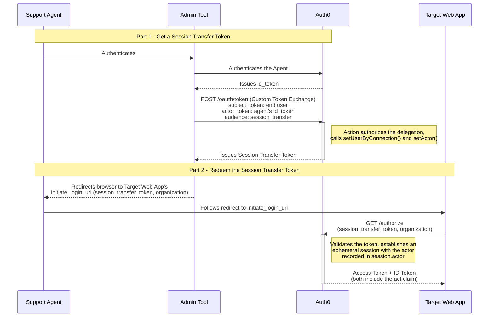

import { ReleaseStageNotice } from "/snippets/fr-ca/ReleaseStageNotice.jsx"

<ReleaseStageNotice feature="Délégation de session" stage="ea" plans="B2C Professional, B2B Professional et Enterprise" terms="true" />

La délégation de session permet à un acteur autorisé, par exemple un agent de soutien, d’ouvrir une session web au nom d’un autre utilisateur dans votre application. Elle s’appuie sur [l’échange de jetons personnalisé](/docs/fr-ca/authenticate/custom-token-exchange) pour émettre un jeton de transfert de session qui identifie à la fois l’utilisateur cible et l’acteur, puis échange ce jeton contre une session au moyen du même mécanisme que le [SSO d’une application native vers une application web](/docs/fr-ca/authenticate/single-sign-on/native-to-web). La délégation est consignée dans les journaux du tenant et peut faire l’objet d’un audit.

<Callout icon="file-lines" color="#0EA5E9" iconType="regular">
  La délégation de session répond à un besoin différent du SSO d’une application native vers une application web. Ce SSO transfère la session d’un utilisateur déjà authentifié depuis votre application native vers votre application web. La délégation de session permet plutôt à un acteur distinct et autorisé d’ouvrir une session **au nom d’un autre utilisateur**, notamment pour l’accès au soutien ou les flux de travail assistés par un agent. Si vous cherchez à transférer un utilisateur connecté de votre application native vers votre application web, consultez plutôt le [SSO d’une application native vers une application web](/docs/fr-ca/authenticate/single-sign-on/native-to-web).
</Callout>

  ## Fonctionnement

La délégation de session se fait en deux étapes : votre application Admin obtient d’abord un jeton de transfert de session, puis l’échange pour établir la session déléguée dans l’application Web cible.

  ### Partie 1 : Obtenir un jeton de transfert de session

1. L’acteur (un agent de soutien) s’authentifie auprès d’Auth0 à l’aide d’un outil d’administration et obtient une preuve de sa propre identité, comme un jeton ID Auth0, à utiliser comme `actor_token`.
2. L’outil d’administration envoie une requête à l’endpoint [`/oauth/token`](/docs/fr-ca/api/authentication/custom-token-exchange/get-token) d’Auth0 au moyen d’une requête échange de jetons personnalisé, en définissant `audience` à `urn:YOUR_AUTH0_TENANT_DOMAIN:session_transfer`.
3. L’[Action échange de jetons personnalisé](/docs/fr-ca/customize/actions/explore-triggers/custom-token-exchange) associée autorise la délégation, définit l’utilisateur sujet (généralement au moyen de `setUserByConnection()`), puis appelle `setActor()` pour enregistrer l’acteur. L’appel à `setActor()` est requis pour obtenir un jeton de transfert de session.
4. Auth0 émet un jeton de transfert de session qui identifie l’utilisateur sujet et consigne l’acteur pour la transaction.

  ### Partie 2 : Échanger le jeton de transfert de session (redirection dans le navigateur)

La manière dont votre application transmet le jeton de transfert de session à l’application Web cible dépend de votre mise en œuvre, mais il est recommandé de l’ajouter comme paramètre de requête à l’`initiate_login_uri` de l’application cible :

5. Votre application redirige le navigateur de l’acteur vers l’`initiate_login_uri` de l’application cible en ajoutant le jeton de transfert de session et, si la connexion doit s’effectuer dans le scope d’une organization, un paramètre `organization` comme paramètres de requête.
6. Le navigateur est alors dirigé vers l’endpoint `/authorize` de votre tenant Auth0 avec le jeton de transfert de session, ce qui déclenche un échange transparent. Auth0 valide le jeton et établit une session déléguée éphémère pour l’utilisateur sujet, tout en enregistrant l’acteur dans `session.actor` à des fins d’audit.
7. L’application cible termine la connexion et reçoit un jeton d’accès et un ID token, qui contiennent tous deux un claim `act` identifiant la délégation.

Consultez [Implement délégation de session](/docs/fr-ca/authenticate/single-sign-on/session-delegation/implement-session-delegation) pour obtenir tous les détails sur la requête et la response, savoir comment créer la redirection et gérer les jetons obtenus. Découvrez comment [Configure délégation de session](/docs/fr-ca/authenticate/single-sign-on/session-delegation/configure-session-delegation) pour votre application, et consultez [Delegated Session Behavior and Monitoring](/docs/fr-ca/authenticate/single-sign-on/session-delegation/session-delegation-behavior-and-monitoring) pour comprendre le comportement des sessions et la journalisation d’audit.

  ## Limites

* Seul le flux avec code d’autorisation est pris en charge pour établir une session déléguée. SAML, WS-Federation et le flux implicite ne sont pas pris en charge.
* Seuls les acteurs à un niveau sont pris en charge. Contrairement aux jetons d’accès de l’échange de jetons personnalisé, qui prennent en charge jusqu’à cinq niveaux d’acteurs imbriqués, un jeton de transfert de session n’accepte qu’un seul acteur.
* **Aucun jeton d’actualisation n’est émis pour les sessions déléguées.**
* Une session déléguée ne peut pas être établie si MFA, le consentement ou une invite d’inscription sont requis. La demande échoue avec `interaction_required` au lieu d’afficher une invite.