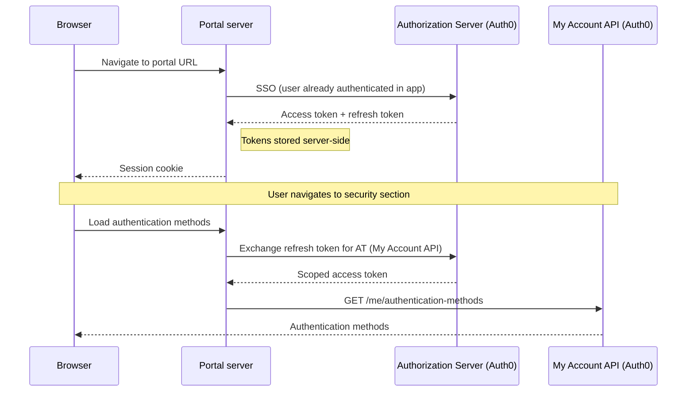
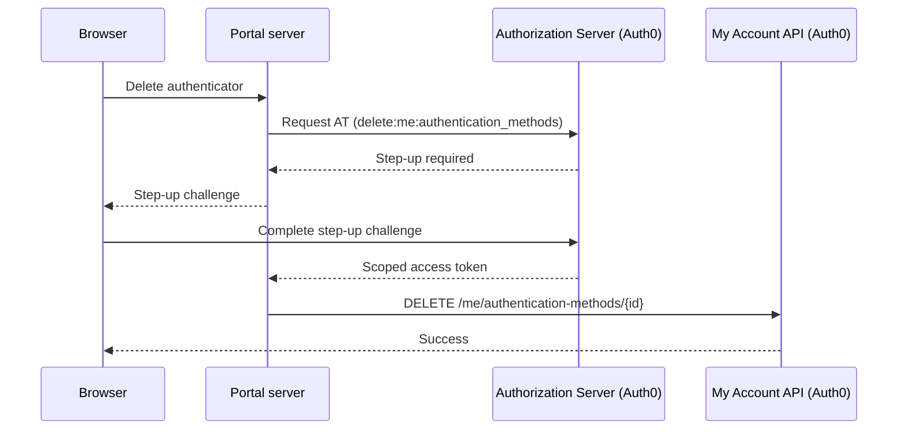
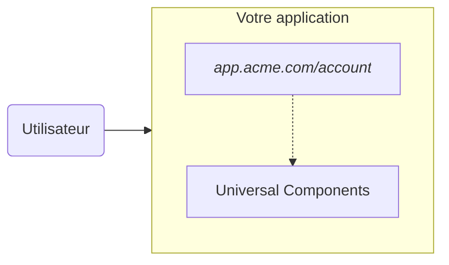
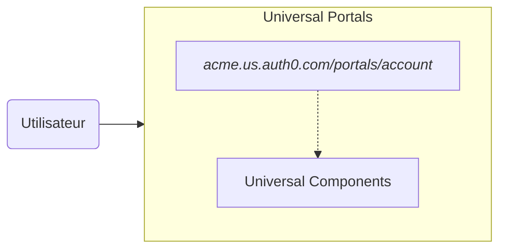

import { ReleaseStageNotice } from "/snippets/fr-ca/ReleaseStageNotice.jsx"

<ReleaseStageNotice feature="Auth0 Universal Portals" stage="beta" terms="true" contact="Auth0 Support" />

Auth0 Universal Portals est une plateforme d’expérience d’identité hébergée. Elle vous permet de déployer des portails prêts à l’emploi et entièrement gérés offrant la gestion de profil, les paramètres d’organisation et plus encore. Vous n’avez pas besoin d’écrire de code, d’héberger l’infrastructure ni d’assurer la maintenance d’une interface utilisateur personnalisée.

Universal Portals vous permet de créer des portails libre-service hébergés par Auth0 à l’aide de [My Account API](/docs/fr-ca/api/myaccount) pour les paramètres personnels ou de [My Organization API](/docs/fr-ca/api/myorganization) pour la gestion des organisations.

<Frame></Frame>

  ## Cas d’utilisation

Universal Portals prend en charge les cas d’utilisation suivants :

* Créez des **portails clients** en libre-service qui permettent aux utilisateurs finaux de gérer le profil de leur compte, de s’inscrire à l’[authentification multifacteur (MFA)](/docs/fr-ca/secure/multi-factor-authentication#multi-factor-authentication-mfa), de modifier leur mot de passe et de configurer leurs paramètres de sécurité.
  Ce cas d’utilisation remplace la page **My Account** que chaque application doit créer de toutes pièces.

<Frame></Frame>

* Créez des **portails d’entreprise** en libre-service qui permettent aux membres de l’organisation de gérer la configuration de celle-ci, la vérification du domaine et la gestion de l’équipe.
  Ce cas d’utilisation remplace la page **My Organization** que chaque application B2B doit créer de toutes pièces.

<Frame></Frame>

  ## Fonctionnalités clés

Universal Portals offre les fonctionnalités suivantes, sans devoir les développer, les configurer ou les maintenir :

* **Éditeur visuel** : configurez les pages du portail à l’aide d’un éditeur par glisser-déposer. Il comprend :

  * **Composants d’identité** : utilisez des [Universal Components](/docs/fr-ca/get-started/universal-components/universal-components-overview) prédéfinis pour la gestion des profils, l’inscription à l’AMF, les changements de mot de passe et les paramètres de l’organisation.
  * **[Auth0 Forms](/docs/fr-ca/customize/forms)** : utilisez des formulaires dans les pages du portail pour recueillir des renseignements auprès des utilisateurs finaux, comme des mises à jour de profil, l’acceptation de politiques et les préférences en matière de communications marketing.
  * **Composants de mise en page** : ajoutez des sections, des séparateurs et d’autres éléments structurels pour organiser visuellement les pages.

* **Portail et application** : chaque portail s’appuie sur une [Regular Web App](/docs/fr-ca/get-started/auth0-overview/create-applications/regular-web-apps#register-regular-web-applications) Auth0.
  * Lorsque vous créez un portail à l’aide de l’Auth0 Dashboard, Auth0 crée et configure automatiquement l’application : les callbacks, les URL de logout, l’accès aux API et les grants sont tous configurés.
  * Vous pouvez également provisionner ces ressources manuellement à l’aide de l’Auth0 CLI ou de la Management API, puis lier l’application lors de la création du portail. Pour en savoir plus, consultez le [Quickstart Universal Portals](/docs/fr-ca/customize/portals/quickstart).

* **Héritage de l’image de marque** : les portails héritent automatiquement des paramètres d’image de marque, du logo, des couleurs et des polices de votre tenant. Dans les scénarios B2B, l’image de marque s’adapte au contexte de l’organisation.

* **Aucune infrastructure** : les portails sont entièrement hébergés par Auth0. Il n’y a rien à déployer, à faire évoluer ni à maintenir.

* **Paramètres de sécurité par défaut** : Universal Portals implémente par défaut les meilleures pratiques de sécurité des identités :

  * [**Logout par canal secondaire**](/docs/fr-ca/authenticate/login/logout/back-channel-logout) : lorsqu’une session se termine, quelle qu’en soit la raison (logout depuis un autre appareil, révocation de session, modifications du compte), la session du portail est automatiquement terminée sur tous les appareils.
  * **Renforcement automatique de l’AMF** : lorsqu’un utilisateur accède à une opération sensible, le portail gère le challenge d’authentification de façon transparente et réessaie l’opération initiale en cas de réussite.

  ## Fonctionnement

Universal Portals permet à vos utilisateurs authentifiés d’accéder à un portail depuis votre application.
Lorsqu’ils accèdent à l’URL du portail, le serveur du portail effectue une [authentification unique](/docs/fr-ca/authenticate/single-sign-on/inbound-single-sign-on) avec Auth0, de manière transparente et sans invite de connexion.

Auth0 émet un [jeton d’accès](/docs/fr-ca/secure/tokens/access-tokens) et un [jeton d’actualisation](/docs/fr-ca/secure/tokens/refresh-tokens), qui sont stockés côté serveur. Le navigateur reçoit uniquement un cookie de [session](/docs/fr-ca/manage-users/sessions) chiffré.

Lorsque l’utilisateur navigue entre les sections, le serveur du portail utilise le jeton d’actualisation pour obtenir un nouveau jeton d’accès limité à la ressource requise par la section.
Le jeton d’actualisation émis lors de la connexion peut être échangé contre des jetons d’accès destinés à différentes audiences, comme la [My Account API](/docs/fr-ca/api/myaccount) pour les paramètres personnels ou la [My Organization API](/docs/fr-ca/api/myorganization) pour la gestion de l’organisation.

Dans le diagramme ci-dessous, l’utilisateur accède à la section Sécurité pour gérer ses méthodes d’authentification, ce qui nécessite la My Account API.

  ### Défis de vérification renforcée

Certaines opérations nécessitent un niveau d’assurance plus élevé. Lorsqu’un utilisateur tente d’effectuer une action sensible, comme [supprimer un authenticator](/docs/fr-ca/api/myaccount/authentication-methods/delete-authentication-method), qui nécessite le scope `delete:me:authentication_methods`, Auth0 indique qu’un défi de vérification renforcée est requis.

Universal Portals gère ce processus automatiquement : il présente le défi de vérification renforcée et réessaie l’opération initiale une fois que l’utilisateur l’a terminé.

  ## Universal Portals et Universal Components

Les Universal Portals et les [Universal Components](/docs/fr-ca/get-started/universal-components/universal-components-overview) utilisent la même bibliothèque de composants, mais se distinguent par la personne responsable de la diffusion.

* Les Universal Portals offrent une expérience entièrement hébergée.
* Les Universal Components offrent une expérience intégrée.

|                                     | **Universal Components (Embedded)**                                        | **Universal Portals (Hosted)**                            |
| ----------------------------------- | -------------------------------------------------------------------------- | ---------------------------------------------------------- |
| **Votre responsabilité**            | Hébergement, layout, intégration de l’authentification, gestion des tokens | Contenu et configuration de la page                        |
| **Parcours de l’utilisateur final** | Reste dans votre application                                               | Redirigé vers une URL de portail distincte                 |
| **Quand choisir**                   | Contrôle complet de l’expérience utilisateur ; aucune redirection requise  | Déploiement le plus rapide ; aucune infrastructure à gérer |

**Universal Components (Embedded)**

**Universal Portals (hébergés)**

  ## En savoir plus

<Card title="Quickstart Universal Portals" icon="gear" href="/docs/fr-ca/customize/portals/quickstart" horizontal>
  Découvrez comment configurer et créer un portail.
</Card>