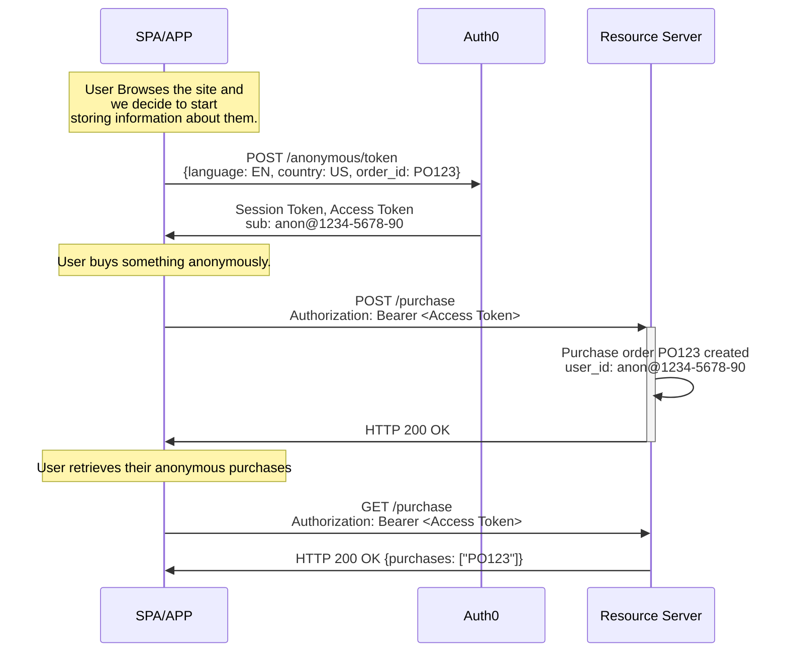
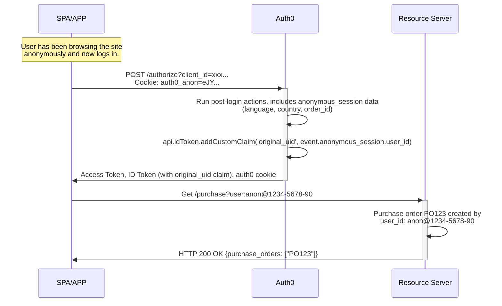

import { ReleaseStageNotice } from "/snippets/fr-ca/ReleaseStageNotice.jsx"

<ReleaseStageNotice feature="Anonymous Sessions" stage="beta" terms="true" contact="Auth0 Support" />

Les sessions anonymes vous permettent de créer et de gérer des [sessions utilisateur](/docs/fr-ca/manage-users/sessions) sans exiger d’authentification.

Les utilisateurs peuvent parcourir le site, ajouter des articles à leur panier ou à leurs listes de souhaits, effectuer des achats et définir des préférences avant de créer un compte. Ils peuvent ensuite transférer leur activité vers leur profil authentifié lorsqu’ils s’inscrivent ou se connectent.

Utilisez les sessions anonymes dans les cas d’utilisation suivants :

* **Suivre les utilisateurs invités** d’un chargement de page à l’autre et d’une session à l’autre
* **Stocker des métadonnées** telles que des références de panier, des préférences, des consentements et des renseignements de profilage
* **Émettre des jetons d’accès** pour les appels d’API sans exiger d’authentification
* **Transférer l’activité anonyme** vers des comptes authentifiés lorsque les utilisateurs s’inscrivent ou se connectent

<Warning>
  Les métadonnées des sessions anonymes Auth0 ne constituent pas un stockage de données sécurisé et ne doivent pas servir à stocker des renseignements sensibles.
  Cela comprend les secrets et les renseignements personnels identifiables (PII) à haut risque, comme les numéros d’assurance sociale ou de carte de crédit.

  De plus, l’exactitude ou la véracité des données stockées dans une session anonyme n’est pas vérifiée; elles ne doivent donc jamais être considérées comme fiables.

  Auth0 recommande fortement à ses clients d’évaluer les données stockées dans les métadonnées et de ne stocker que celles nécessaires au balisage des sessions et à la gestion des accès.
  Pour en savoir plus, consultez [la conformité d’Auth0 au Règlement général sur la protection des données](/docs/fr-ca/secure/data-privacy-and-compliance/gdpr).&quot;
</Warning>

<div id="how-it-works">
  ## Comment ça fonctionne
</div>

<div id="gather-anonymous-sessions-data">
  ### Recueillir des données sur les sessions anonymes
</div>

Lorsque vous commencez à recueillir des renseignements sur un utilisateur, même s’il ne s’est pas encore authentifié, votre application envoie une requête `POST` au point de terminaison `/anonymous/token`.

Auth0 renvoie deux jetons :

* Un [**jeton de session**](/docs/fr-ca/secure/tokens/session-tokens) qui identifie et enregistre la session anonyme.
* Un [**jeton d’accès**](/docs/fr-ca/secure/tokens/access-tokens) que l’utilisateur peut présenter à vos [serveurs de ressources (API)](/docs/fr-ca/get-started/apis).

Les requêtes ultérieures qui comprennent le jeton de session poursuivent la même session pour le même `user_id`, ce qui permet de retracer toute l’activité jusqu’à une même origine.
À l’aide du jeton d’accès, les utilisateurs anonymes peuvent appeler n’importe laquelle de vos API existantes.



```json Anonymous session data of user anon@1234-5678-90
{
  "user_id": "anon@1234-5678-90",
  "session_id": "sess_456",
  "metadata": {
    "language": "EN",
    "country": "US",
    "purchase": "P0123"
  }
}
```

<div id="transfer-anonymous-sessions-data-to-users-metadata">
  ### Transférer les données de session anonymes vers les métadonnées de l’utilisateur
</div>

Lorsqu’un utilisateur disposant d’une session anonyme décide de se connecter ou de s’inscrire, votre application transmet le `anonymous_session_token` au point de terminaison `/authorize` au moyen d’un cookie ou d’un en-tête HTTP.

```javascript cookie example
// Aucun code supplémentaire n’est nécessaire — le cookie est envoyé automatiquement
await auth0.loginWithRedirect();
```

```javascript authorize endpoint example
GET /authorize?
  client_id: YOUR_CLIENT_ID&
  redirect_uri: https://YOUR_ClIENT_URL/callback&
  response_type: code&
  scope: openid&
  Auth0-Anonymous-Session: eyJhbGciOiJkaXIiLCJlbmMiOiJBMjU2R0NNIn0...
```



Auth0 met les données de session anonyme à votre disposition dans les déclencheurs Actions [`pre-user-registration`](/docs/fr-ca/customize/actions/explore-triggers/signup-and-login-triggers/pre-user-registration-trigger)  et [`post-login`](/docs/fr-ca/customize/actions/explore-triggers/signup-and-login-triggers/login-trigger) à l’aide de l’objet `event.anonymous_session`.

```json anonymous session object
{
  "anonymous_session": {
    "user_id": "anon@1234-5678-90",
    "session_id": "sess_123",
    "created_at": "2026-05-14T10:30:00Z",
    "metadata": {
      "language": "en",
      "country": "US",
      "order_id": "PO123"
    }
  }
}
```

Pour en savoir plus sur les sessions anonymes avec Actions, consultez les [cas d’utilisation des sessions anonymes](/docs/fr-ca/manage-users/sessions/anonymous-sessions/anonymous-sessions-use-cases).

<div id="end-the-anonymous-session-after-transfer">
  ### Mettre fin à la session anonyme après le transfert
</div>

Les sessions anonymes ne sont pas automatiquement invalidées lorsqu’un utilisateur s’authentifie. Pour mettre fin à la session, utilisez le point de terminaison `/anonymous/logout` :

```javascript wrap lines
// Dans votre application, après une connexion réussie
if (wasAnonymousSession) {
  await fetch('https://YOUR_DOMAIN/anonymous/logout', {
    method: 'POST',
    headers: { 'Content-Type': 'application/json' },
    credentials: 'include', // Envoyer les cookies
    body: JSON.stringify({ client_id: 'YOUR_CLIENT_ID' }),
  });
}
```

<div id="best-practices">
  ## Bonnes pratiques
</div>

Voici quelques bonnes pratiques pour les sessions anonymes :

* Configurez des [durées de vie appropriées pour les sessions anonymes](/docs/fr-ca/manage-users/sessions/anonymous-sessions/configure-anonymous-sessions#configure-anonymous-sessions-in-your-auth0-tenant) afin d’éviter de perdre les données de session anonyme d’un utilisateur. Auth0 recommande une durée de vie d’au moins 30 jours.

* Sélectionnez le chiffrement [JSON Web Encryption (JWE)](/docs/fr-ca/manage-users/sessions/anonymous-sessions/configure-anonymous-sessions#configure-anonymous-sessions-in-your-auth0-tenant) pour les sessions anonymes afin d’empêcher d’éventuels attaquants d’en voir le contenu.

* Limitez les actions que les utilisateurs anonymes `anon@` peuvent effectuer dans votre API.

* Validez les jetons et assainissez les métadonnées. Ne faites jamais confiance aux métadonnées ou aux jetons provenant des clients sans validation côté serveur.

* Mettez en cache les [jetons d’accès](/docs/fr-ca/secure/tokens/access-tokens), car ils peuvent être réutilisés jusqu’à leur expiration.

* Regroupez les [mises à jour des métadonnées](/docs/fr-ca/manage-users/sessions/anonymous-sessions/configure-anonymous-sessions#update-the-session-with-metadata) et limitez-en le nombre. Évitez les mises à jour fréquentes des métadonnées.

<div id="limitations">
  ## Limites
</div>

* Les flux de [réinitialisation du mot de passe](/docs/fr-ca/customize/actions/explore-triggers/password-reset-triggers#password-reset-triggers) ne sont pas pris en charge pour les sessions anonymes.
* Le [Device Code](/docs/fr-ca/get-started/authentication-and-authorization-flow/device-authorization-flow) n’est pas pris en charge, car la requête d’authentification et la connexion proprement dite ont lieu sur des appareils différents.
* L’[authentification CIBA (Client-Initiated Backchannel Authentication)](/docs/fr-ca/get-started/applications/configure-client-initiated-backchannel-authentication) n’est pas prise en charge, car la requête d’authentification et la confirmation ont lieu sur des appareils différents.
* L’[échange de jeton personnalisé](/docs/fr-ca/authenticate/custom-token-exchange/cte-example-use-cases) n’est pas pris en charge en raison de la nature des transactions (par exemple, l’usurpation d’identité), qui risque d’attribuer des données anonymes au mauvais utilisateur.
* L’[échange de jeton d’actualisation](/docs/fr-ca/secure/call-apis-on-users-behalf/token-vault/configure-token-vault#configure-token-exchange) n’est pas pris en charge pour les sessions anonymes, car l’utilisateur est déjà connecté s’il possède un jeton d’actualisation.

<div id="learn-more">
  ## En savoir plus
</div>

* [Configurer les sessions anonymes](/docs/fr-ca/manage-users/sessions/anonymous-sessions/configure-anonymous-sessions) Découvrez comment configurer les sessions anonymes.
* [Cas d’utilisation des sessions anonymes](/docs/fr-ca/manage-users/sessions/anonymous-sessions/anonymous-sessions-use-cases) Découvrez les cas d’utilisation des sessions anonymes.