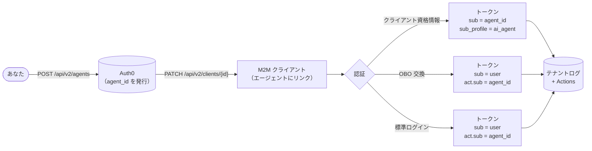

import { ReleaseStageNotice } from "/snippets/ja-jp/ReleaseStageNotice.jsx"

<ReleaseStageNotice feature="Agents as Principal" stage="ea" contact="Auth0 Support" terms="true" />

プリンシパルとしてのAIエージェント では、AI エージェントを、人間のユーザーや従来のマシンツーマシン (M2M) クライアントとは異なる、Auth0 における第一級のアイデンティティとして導入します。エージェントは、安定した識別子を持ち、独自のライフサイクル管理、資格情報、監査証跡を備えた登録済みエンティティです。

Auth0 プリンシパルとして登録されると、エージェントは次のことが可能になります。

* ユーザーに代わって行動する
* ユーザーセッションなしで自律的に実行する
* トークン交換を通じてマルチホップの委譲を行う

  ## ユースケース

* 自律型エージェント: AIエージェントがクライアント資格情報を使用して、自身の資格で直接APIを呼び出します。そのアイデンティティはログとトークンで追跡されます。
* 委譲アクセス: ユーザーはAIエージェントに自身の代理として行動することを認可します。エージェントはユーザーのアクセストークンを委譲トークンと交換し、ユーザーをサブジェクトとして維持しながら、エージェントをアクターとして識別します。
* マルチホップチェーン: オーケストレーションエージェントがサブエージェントに委譲します。委譲チェーンはネストされた`act`クレームに保持され、任意のリソースサーバーで完全な追跡可能性を実現します。

  ## 仕組み

プリンシパルとしてのAIエージェント は、登録、クライアントの関連付け、トークンの発行という3つのステージで構成されています。

1. [エージェントを登録する](/docs/ja-jp/ai-agents-mcp/agents-as-principal/register-an-agent): Auth0 Dashboard または Management API を使用して、Auth0 にエージェントを登録します。Auth0 は、ライフサイクル全体にわたってトークン、ログ、Management API で追跡できる、安定した `agent_id` を持つ[エージェントオブジェクト](/docs/ja-jp/ai-agents-mcp/agents-as-principal/register-an-agent#agent-object)を作成します。

2. [エージェントをクライアントに関連付ける](/docs/ja-jp/ai-agents-mcp/agents-as-principal/associate-agent-client): エージェントには独自の資格情報はなく、関連付けられた 1 つ以上のクライアントを通じて認証されます。1 つのエージェントは複数のクライアントにリンクできるため、ログ上では単一の論理アイデンティティを維持したまま、環境やリージョンごとにクライアントを分けることができます。

3. [トークン内のエージェントアイデンティティ](/docs/ja-jp/ai-agents-mcp/agents-as-principal/agent-identity-in-tokens): エージェントにリンクされたクライアントが認証されると、Auth0 はグラントタイプに応じて、発行するトークンにエージェントのアイデンティティを埋め込みます。

`agent_id` (作成時に設定されている場合は `external_agent_id`) は、トークンの発行ごとに[テナントログ](/docs/ja-jp/ai-agents-mcp/agents-as-principal/tenant-logs)にも記録されるため、エージェントごとの完全な監査証跡を取得できます。また、[Actions](/docs/ja-jp/ai-agents-mcp/agents-as-principal/actions-context)では、`event.agent` を介してエージェントのアイデンティティにアクセスし、トークン発行時にカスタムロジックを適用することもできます。

  ## 移行ガイダンス

既存のクライアントとリソースサーバーで、プリンシパルとしてのAIエージェントを使用するよう移行します。

  ### クライアント

既存のクライアントは、明示的にエージェントに関連付けない限り影響を受けません。エージェントとの関連付けはオプトインで、いつでも解除できます。詳しくは、[エージェントをクライアントに関連付ける](/docs/ja-jp/ai-agents-mcp/agents-as-principal/associate-agent-client)を参照してください。

  ### リソースサーバー

`sub_profile` および `client_profile` クレームを受け取るには、対象のリソースサーバーの設定で `agent_subject_claims: 'auth0-v1'` を設定します。この設定はリソースサーバーごとにオプトインが必要です。詳細については、「[エージェントのサブジェクトクレームを受け取るようリソースサーバーを設定する](/docs/ja-jp/ai-agents-mcp/agents-as-principal/agent-identity-in-tokens#configure-resource-server-to-receive-agent-subject-claims)」を参照してください。