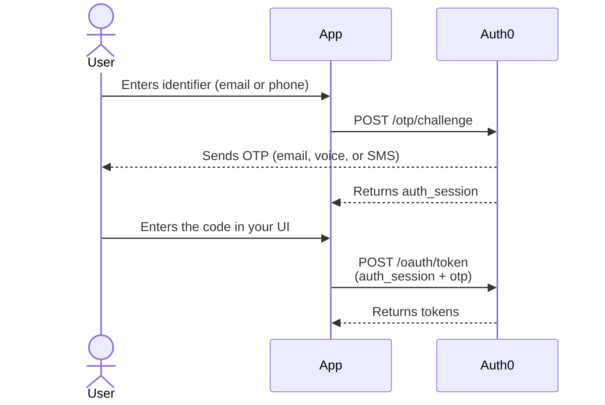

import { ReleaseStageNotice } from "/snippets/ja-jp/ReleaseStageNotice.jsx"

<ReleaseStageNotice feature="Authentication API を使用したデータベース接続のパスワードレス認証" stage="ea" contact="support" terms="true" />

カスタムログイン UI を備えた Native アプリケーションおよびバックエンドアプリケーションでは、Universal Login にリダイレクトすることなく、Auth0 Authentication API を介してメールアドレスまたは電話番号に直接送信されるワンタイムパスワード (OTP) でユーザーを認証できます。標準のデータベース接続で、メール OTP、SMS OTP、音声 OTP をサポートします。

これにより、すでにユーザーを保存しているデータベース接続でワンタイムコード認証を利用できます。以前、専用のパスワードレス接続で `/passwordless/start` を使用していた場合は、既存のデータベース接続に統合できます。Universal Login でパスワードレス認証を使用する方法については、[データベース接続のパスワードレス認証](/docs/ja-jp/authenticate/database-connections/passwordless-authentication-for-db-connect)を参照してください。

<Callout icon="file-lines" color="#0EA5E9" iconType="regular">
  Passwordless OTP グラントは、シングルページアプリケーション (SPA) タイプのアプリケーションでは利用できません。フロントエンドがシングルページアプリケーションの場合は、Passwordless OTP グラントを有効にしたバックエンドアプリケーションから `/otp/challenge` と `/oauth/token` を呼び出してください。
</Callout>

認証は、次の 2 回の呼び出しで構成されるフローです。

1. `POST /otp/challenge` — ユーザーのメールアドレスまたは電話番号にワンタイムコードを送信します。
2. `POST /oauth/token` — ユーザーが入力したコードをトークンと交換します。

<div id="how-it-works">
  ## 仕組み
</div>



1. ユーザーがアプリケーションでメールアドレスまたは電話番号を入力します。
2. アプリケーションが[`POST /otp/challenge`](/docs/ja-jp/api/authentication/passwordless/get-code-or-link)エンドポイントを呼び出します。
3. Auth0 Authorization Serverが、ユーザーのメールアドレスまたは電話番号宛てにワンタイムコードを送信します。
4. Auth0 Authorization Serverが`auth_session`値を返します。この値を保存してください。ほかにstateを保持する必要はありません。
5. ユーザーがコードを受け取り、アプリケーションのUIに入力します。
6. アプリケーションが`auth_session`とユーザーが入力したコードを指定して、[`POST /oauth/token`](/docs/ja-jp/api/authentication/passwordless/get-token)エンドポイントを呼び出します。
7. Auth0 Authorization Serverが`auth_session`に対してコードを検証し、ID トークンとアクセストークン (必要に応じてリフレッシュトークンも) を返します。

このフローは、アプリケーションの観点ではステートレスです。2回の呼び出しの間で保持する値は、手順4で返される`auth_session`文字列だけです。リクエストがログインかサインアップか、またMFAが必要かどうかはAuth0が判断するため、それらを自分で管理する必要はありません。詳細については、[Auth0がログインとサインアップを判断する方法](#how-auth0-determines-login-vs-signup)をお読みください。

<Card title="開始前に">
  * データベース接続で、認証方法として`email_otp`および/または`phone_otp`を設定します。詳細については、[データベース接続でのパスワードレス認証](/docs/ja-jp/authenticate/database-connections/passwordless-authentication-for-db-connect)をお読みください。
  * 暗黙的なサインアップフローでユーザーがサインアップできるようにする場合は、サインアップ時のOTP検証を有効にします。詳細については、[データベース接続でのパスワードレス認証](/docs/ja-jp/authenticate/database-connections/passwordless-authentication-for-db-connect)をお読みください。
  * Auth0 DashboardまたはManagement APIでPasswordless OTPグラントを有効にします。詳細については、[グラントタイプの更新](/docs/ja-jp/get-started/applications/update-grant-types)をお読みください。
  * バックエンドWebアプリケーションなどの機密アプリケーションは、両方の呼び出しで`client_secret`を送信する必要があります。ネイティブアプリケーションなどのパブリッククライアントでは必要ありません。
  * 音声OTPを使用するには、音声を配信チャネルとして使用できるよう、[Unified Phone Experience](/docs/ja-jp/customize/phone-messages/unified-phone/configure-unified-phone)を有効にします。
</Card>

<div id="initiate-the-otp-challenge">
  ## OTP チャレンジを開始する
</div>

ユーザーの識別子を送信します。Auth0 がコードを生成・配信し、不透明な `auth_session` を返します。

```bash lines
curl --request POST \
  --url 'https://YOUR_DOMAIN/otp/challenge' \
  --header 'Content-Type: application/json' \
  --data '{
    "connection": "YOUR_CONNECTION_NAME",
    "client_id": "YOUR_CLIENT_ID",
    "email": "user@example.com"
  }'
```

<div id="parameters">
  ### パラメータ
</div>

| パラメータ             | 必須   | 説明                                                                                                                                  |
| ----------------- | ---- | ----------------------------------------------------------------------------------------------------------------------------------- |
| `connection`      | はい   | メール OTP および／または Phone OTP が設定されているデータベース接続の名前。                                                                                    |
| `client_id`       | はい   | アプリケーションの クライアント ID。                                                                                                                |
| `email`           | 条件付き | ユーザーのメールアドレス。`email` または `phone_number` のいずれか一方を指定してください。両方は指定できません。                                                                |
| `phone_number`    | 条件付き | 国コードを含む [E.164](https://en.wikipedia.org/wiki/E.164) 形式のユーザーの電話番号 (例: `+15555550123`) 。`email` または `phone_number` のいずれか一方を指定してください。 |
| `client_secret`   | 条件付き | [機密アプリケーション](/docs/ja-jp/get-started/applications/confidential-and-public-applications)で必要です。                                             |
| `allow_signup`    | いいえ  | `true` の場合、ユーザーが存在せず、かつ接続で サインアップ が有効になっていると、Auth0 はユーザーを作成します。デフォルトは `false` です。詳しくは、[暗黙的なサインアップ](#implicit-signup)を参照してください。      |
| `delivery_method` | いいえ  | 電話で配信する場合、接続で両方が有効になっているときは `text` または `voice` を選択します。                                                                              |

フィールド名 (`email` または `phone_number`) によって、Auth0 が使用するチャネルが決まります。識別子の `type` を別途送信する必要はありません。

<div id="response">
  ### レスポンス
</div>

```json lines
HTTP/1.1 200 OK
Content-Type: application/json

{
  "auth_session": "507f1f77bcf86cd799439011"
}
```

`/otp/challenge` は、ユーザーが存在するかどうかにかかわらず `200 OK` を返します。これにより、ユーザー列挙を防止します。攻撃者はこのエンドポイントを利用して、どの識別子にアカウントが存在するかを特定できません。`auth_session` は不透明な文字列として扱い、保存したうえで変更せずに次の呼び出しに渡してください。

<div id="exchange-the-code-for-tokens">
  ## コードをトークンに交換する
</div>

ユーザーがコードを入力したら、前回のcallで取得した`auth_session`とともに送信します。

```bash lines
curl --request POST \
  --url 'https://YOUR_DOMAIN/oauth/token' \
  --header 'Content-Type: application/json' \
  --data '{
    "grant_type": "http://auth0.com/oauth/grant-type/passwordless/otp",
    "client_id": "YOUR_CLIENT_ID",
    "auth_session": "507f1f77bcf86cd799439011",
    "otp": "123456",
    "scope": "openid profile email"
  }'
```

<div id="parameters">
  ### パラメータ
</div>

| パラメータ           | 必須   | 説明                                                              |
| --------------- | ---- | --------------------------------------------------------------- |
| `grant_type`    | はい   | `http://auth0.com/oauth/grant-type/passwordless/otp`である必要があります。 |
| `client_id`     | はい   | アプリケーションのクライアントID。                                              |
| `auth_session`  | はい   | `POST /otp/challenge`から返される不透明な値。                               |
| `otp`           | はい   | ユーザーが入力するワンタイムパスワード。                                            |
| `client_secret` | 条件付き | 機密アプリケーションでは必須です。                                               |
| `scope`         | いいえ  | 要求するスコープをスペースで区切ったリスト。例: `openid profile email`。                |

<div id="response">
  ### レスポンス
</div>

```json lines
HTTP/1.1 200 OK
Content-Type: application/json

{
  "access_token": "eyJ...",
  "id_token": "eyJ...",
  "token_type": "Bearer",
  "expires_in": 86400
}
```

<div id="implicit-signup">
  ## 暗黙的なサインアップ
</div>

デフォルトでは、Authentication API は `allow_signup: false` により既存のユーザーのみを認証します。`POST /otp/challenge` に `allow_signup: true` を指定すると、ユーザーがまだ存在せず、接続でサインアップが有効になっている場合、OTP の検証に成功した時点でアカウントを作成できます。

* `allow_signup: false`: Auth0 がユーザーを作成することはありません。未知の識別子はトークン交換時に失敗します。
* `allow_signup: true`: ユーザーが存在せず、接続でサインアップが許可されている場合、OTP の検証時にアカウントが作成され、同じステップでトークンが発行されます。

暗黙的なサインアップを成功させるには、接続で単一の識別子を必須にするか、すべての識別子を任意にする必要があります。詳細については、[パスワードレスデータベース接続での暗黙的なサインアップとログイン](/docs/ja-jp/authenticate/database-connections/implicit-signup-database-connections)を参照してください。

<div id="how-auth0-determines-login-vs-signup">
  ## Auth0 によるログインとサインアップの判別方法
</div>

ユーザーが新規か既存かにかかわらず、アプリケーションは常に同じ 2 つの呼び出しを行います。Auth0 は challenge 時に意図を判別し、サーバー側で `auth_session` に記録します。トークン交換時に、Auth0 はセッションを参照して適切な処理を行います。

| `/otp/challenge` での状況                     | `/oauth/token` での結果 (正しい OTP の場合)     |
| ----------------------------------------- | ------------------------------------- |
| ユーザーが存在する                                 | ログイン時に、Auth0 は既存ユーザーに対してトークンを発行します。   |
| ユーザーが見つからず、`allow_signup: true`、サインアップが有効 | サインアップ時に、Auth0 はアカウントを作成してトークンを発行します。 |

<Callout icon="file-lines" color="#0EA5E9" iconType="regular">
  ブロックされている場合は、意図的に誤った OTP の場合と同じエラーが返されるため、レスポンスからアカウントの存在有無が明らかになることはありません。
</Callout>

<div id="multi-factor-authentication">
  ## 多要素認証
</div>

MFA が必要な場合、`POST /oauth/token` は `mfa_required` エラーを含む `403` を返します。

```json lines
HTTP/1.1 403 Forbidden
Content-Type: application/json

{
  "error": "mfa_required",
  "mfa_token": "eyJ...",
  "mfa_requirements": {
    "challenge_types": ["otp", "oob"]
  }
}
```

`mfa_token` を使用して [MFA API](/docs/ja-jp/secure/multi-factor-authentication/multi-factor-authentication-developer-resources/mfa-api) を呼び出し、追加の認証要素に対するチャレンジと検証を行います。この動作は、他のすべての Auth0 グラントタイプにおける MFA の動作と同じです。

<div id="error-responses">
  ## エラー応答
</div>

どちらのエンドポイントも、[RFC 6749](https://datatracker.ietf.org/doc/html/rfc6749#section-5.2) に基づく OAuth 2.0 のエラー形式を使用します。この形式には、`error` コードと人間が読み取れる `error_description` が含まれます。パラメータのバリデーションに失敗した場合 (`400`) には、該当するフィールドを特定する `validation_errors` 配列も含まれます。

```json lines
{
  "error": "invalid_request",
  "error_description": "Either email or phone_number must be provided",
  "validation_errors": [
    { "field": "email", "message": "Either email or phone_number must be provided" }
  ]
}
```

<div id="post-otpchallenge">
  ### POST /otp/challenge
</div>

| HTTP ステータス | `error`               | 発生条件                                                                                |
| ---------- | --------------------- | ----------------------------------------------------------------------------------- |
| 400        | `invalid_request`     | `connection` または `client_id` がない、識別子 がいずれも指定されていない、またはメールアドレスか電話番号の形式が不正な場合。 |
| 400        | `invalid_connection`  | 接続が存在しない、データベース接続ではない、またはメールまたは電話の OTP が設定されていない場合。                                 |
| 401        | `invalid_client`      | Confidential アプリケーションに `client_secret` がない、または誤った `client_secret` が送信された場合。         |
| 403        | `unauthorized_client` | アプリケーションで Passwordless OTP グラントが有効になっていない場合。                                        |
| 429        | `too_many_requests`   | 1 つの IP アドレスから 1 時間に 50 件を超えるリクエストがあった場合。                                           |
| 500        | `server_error`        | 予期しない内部エラー。                                                                         |

<div id="post-oauthtoken">
  ### POST /oauth/token
</div>

| HTTP ステータス | `error`             | 発生条件                                                                                                                    |
| ---------- | ------------------- | ----------------------------------------------------------------------------------------------------------------------- |
| 400        | `invalid_request`   | `auth_session` が無効、期限切れ、または使用済みである場合、`otp` または `client_id` が欠けている場合、OTP が誤っているか期限切れである場合 (ブロックされたサインアップの試行に対しても返されます) 。 |
| 401        | `invalid_client`    | Confidential アプリケーションで `client_secret` が指定されていない、または誤った `client_secret` が送信された場合。                                       |
| 403        | `access_denied`     | アカウントが管理者または総当たり攻撃対策によってブロックされている場合。                                                                                    |
| 403        | `mfa_required`      | MFA が必要な場合。レスポンスには `mfa_token` と `mfa_requirements` が含まれます。                                                             |
| 429        | `too_many_requests` | token endpoint に対するグローバルなレート制限を超過した場合。                                                                                  |
| 500        | `server_error`      | 予期しない内部エラー。                                                                                                             |

<div id="rate-limits">
  ## レート制限
</div>

`POST /otp/challenge` は、グローバルな[Authentication API のレート制限](/docs/ja-jp/troubleshoot/customer-support/operational-policies/rate-limit-policy)に加え、IP アドレスごとに 1 時間あたり 50 リクエストに制限されています。制限を超えると、`429 Too Many Requests` が返されます。

レート制限が適用されたレスポンスには、次のヘッダーが含まれます。

| ヘッダー                    | 説明                               |
| ----------------------- | -------------------------------- |
| `X-RateLimit-Limit`     | ウィンドウに設定されたリクエスト上限。              |
| `X-RateLimit-Remaining` | 現在のウィンドウで残りのリクエスト数。              |
| `X-RateLimit-Reset`     | ウィンドウがリセットされる Unix タイムスタンプ。      |
| `Retry-After`           | 再試行可能になるまでの秒数 (`429` レスポンスの場合) 。 |

<div id="limitations">
  ## 制限事項
</div>

* シングルページアプリケーション (SPA) ではPasswordless OTPグラントを有効にできないため、これらのエンドポイントを直接使用することはできません。有効なグラントを持つバックエンドアプリケーション経由で呼び出してください。
* 機密アプリケーションは、両方の呼び出しで `client_secret` を送信する必要があります。
* Authentication API は、メールまたは電話のOTPが設定されたデータベース接続に対して認証を行います。メールまたはSMS専用のパスワードレス接続において、`/passwordless/start` の代替となるものではありません。

<div id="learn-more">
  ## 詳細情報
</div>

* [データベース接続でのパスワードレス認証](/docs/ja-jp/authenticate/database-connections/passwordless-authentication-for-db-connect)
* [パスワードレスデータベース接続での暗黙的なサインアップとログイン](/docs/ja-jp/authenticate/database-connections/implicit-signup-database-connections)
* [Authentication APIを使用した多要素認証](/docs/ja-jp/secure/multi-factor-authentication/authenticate-using-ropg-flow-with-mfa)
* [Authentication APIのレート制限](/docs/ja-jp/troubleshoot/customer-support/operational-policies/rate-limit-policy)