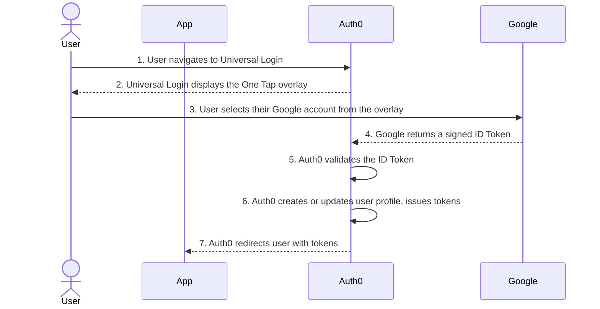

import { ReleaseStageNotice } from "/snippets/ja-jp/ReleaseStageNotice.jsx"

<ReleaseStageNotice feature="Google One Tap" stage="ea" terms="true" />

Auth0 は、[Universal Login](/docs/ja-jp/authenticate/login/auth0-universal-login/universal-login-vs-classic-login/universal-experience) での [Google One Tap](https://developers.google.com/identity/gsi/web/guides/overview) によるユーザー認証をサポートしています。Google One Tap を使用すると、ブラウザーで有効な Google セッションを利用して、Universal Login ページを離れることなく、ワンタップでログインまたはサインアップできます。有効な Google アカウントを持つユーザーがログインページにアクセスすると、そのアクティブなアカウントが表示された Google One Tap プロンプトがオーバーレイとして表示されます。ユーザーがそのアカウントを選択すると、Auth0 が認証情報を検証してセッションを作成します。Google へのリダイレクトは不要です。

<div id="how-it-works">
  ## 仕組み
</div>

Google One Tap は、サードパーティ Cookie やページリダイレクトに依存しない、ブラウザネイティブの認証標準である [Federated Credential Management (FedCM) API](https://developer.chrome.com/docs/identity/fedcm/overview) を使用します。



1. ユーザーが、ブラウザーで有効な Google セッションを保持した状態で Universal Login ページにアクセスします。
2. Universal Login が有効な Google セッションを検出し、Google One Tap のオーバーレイを表示します。
3. ユーザーがプロンプトで Google アカウントを選択します。
4. Google が署名付き ID トークンを Universal Login に返します。
5. Auth0 が、tenant に設定されている Google ソーシャル接続に対して ID トークンを検証します。
6. Auth0 がユーザープロファイルを作成または更新し、Auth0 トークンを発行します。
7. Auth0 がユーザーをアプリケーションにリダイレクトします。

ユーザーのブラウザーが FedCM をサポートしていない場合や、ユーザーがプロンプトを閉じた場合でも、ログインページでは標準の **Google で続行** オプションを引き続き利用できます。ユーザーがプロンプトを閉じるたびに、Google は [指数関数的なクールダウン](https://developers.google.com/identity/gsi/web/guides/features#exponential_cooldown)期間を適用します。

<Card title="開始する前に">
  * tenant で Universal Login を有効化して設定する必要があります。Google One Tap はクラシックログインエクスペリエンスではサポートされていません。詳細については、[Universal Login と Classic Login](/docs/ja-jp/authenticate/login/auth0-universal-login/universal-login-vs-classic-login)を参照してください。
  * tenant で Google ソーシャル接続 (`google-oauth2`) を作成して設定する必要があります。詳細については、[アプリに Google Login を追加する](/docs/ja-jp/authenticate/identity-providers/social-identity-providers/google)を参照してください。
</Card>

<div id="enable-google-one-tap">
  ## Google One Tap を有効にする
</div>

Auth0 Dashboard、Management API、または Auth0 SDK を使用して、個々のアプリケーションで Google One Tap を有効にします。

<Callout icon="file-lines" color="#0EA5E9" iconType="regular">
  Auth0 の Google One Tap 連携は、[Token Vault](/docs/ja-jp/secure/call-apis-on-users-behalf/token-vault#token-vault) および [Connected Accounts for Token Vault](/docs/ja-jp/secure/call-apis-on-users-behalf/token-vault/connected-accounts-for-token-vault) に対応していません。Token Vault が有効な状態で Google One Tap を有効にすると、Google One Tap のプロンプトは表示されません。
</Callout>

<Tabs>
  <Tab title="Auth0 Dashboard">
    1. [Auth0 Dashboard &gt; アプリケーション](https://manage.auth0.com/#/applications)に移動します。
    2. [新しいアプリケーションを作成](/docs/ja-jp/get-started/auth0-overview/create-applications)するか、Google One Tap で使用する既存のアプリケーションを選択します。
    3. ［設定］で「Social Login」を検索し、**Allow Google One Tap** をオンにします。
       <Frame></Frame>
    4. **Save** を選択します。
    5. [Auth0 Dashboard &gt; Authentication &gt; Social](https://manage.auth0.com/#/connections/social)に移動します。
    6. 新しい Google ソーシャル接続を作成するか、既存の `google-oauth2` 接続を選択します。
    7. 接続の設定で、次を確認します。
       * ［設定］タブで、Google Client ID と Client Secret を確認します。One Tap 連携では、[Auth0 developer keys](/docs/ja-jp/authenticate/identity-providers/social-identity-providers/devkeys)は使用できません。
       * ［アプリケーション］タブで、One Tap に使用するアプリケーションがオンになっていることを確認します。
    8. **Save** を選択します。
  </Tab>

  <Tab title="Management API">
    [Update a client](/docs/ja-jp/api/management/v2/clients/patch-clients-by-id) エンドポイントを呼び出し、`fedcm_login.google.is_enabled` を `true` に設定します。

    ```json
    PATCH /api/v2/clients/{id}

    {
      "fedcm_login": {
        "google": {
          "is_enabled": true
        }
      }
    }
    ```

    特定のアプリケーションで Google One Tap を無効にするには、`is_enabled` を `false` に設定します。
  </Tab>

  <Tab title="Auth0 SDK">
    以下の例を使用して、Auth0 SDK で Universal Login に Google One Tap を追加します。最適なエクスペリエンスを得るため、最新バージョンの Auth0 SDK を使用することをお勧めします。

    <AccordionGroup>
      <Accordion title="C#">
        ```csharp
        using Auth0.ManagementApi;
        using Auth0.ManagementApi.Types;
        using System.Threading.Tasks;

        public partial class Examples
        {
            public async Task Example() {
                var client = new ManagementClient(
                    token: "<token>"
                );

                await client.Clients.UpdateAsync(
                    id: "id",
                    request: new UpdateClientRequestContent {
                        FedcmLogin = new FedCmLoginPatch {
                            Google = new FedCmLoginGooglePatch {
                                IsEnabled = true
                            }
                        }
                    }
                );
            }

        }
        ```
      </Accordion>

      <Accordion title="Go">
        ```go
        package example

        import (
            context "context"

            management "github.com/auth0/go-auth0/management/management"
            client "github.com/auth0/go-auth0/management/management/client"
            option "github.com/auth0/go-auth0/management/management/option"
        )

        func do() {
            client := client.NewClient(
                option.WithToken(
                    "<token>",
                ),
            )
            request := &management.UpdateClientRequestContent{
                FedcmLogin: &management.FedCmLoginPatch{
                    Google: &management.FedCmLoginGooglePatch{
                        IsEnabled: true,
                    },
                },
            }
            client.Clients.Update(
                context.TODO(),
                "id",
                request,
            )
        }
        ```
      </Accordion>

      <Accordion title="Java">
        ```java
        package com.example.usage;

        import com.auth0.client.mgmt.ManagementApi;
        import com.auth0.client.mgmt.resources.clients.requests.UpdateClientRequestContent;
        import com.auth0.client.mgmt.types.FedCmLoginPatch;
        import com.auth0.client.mgmt.types.FedCmLoginGooglePatch;

        public class Example {
            public static void main(String[] args) {
                ManagementApi client = ManagementApi
                    .builder()
                    .token("<token>")
                    .build();

                client.clients().update(
                    "id",
                    UpdateClientRequestContent
                        .builder()
                        .fedcmLogin(
                            FedCmLoginPatch.builder()
                                .google(
                                    FedCmLoginGooglePatch.builder()
                                        .isEnabled(true)
                                        .build()
                                )
                                .build()
                        )
                        .build()
                );
            }
        }
        ```
      </Accordion>

      <Accordion title="PHP">
        ```php
        <?php

        namespace Example;

        use Auth0\SDK\API\Management\Management;
        use Auth0\SDK\API\Management\Clients\Requests\UpdateClientRequestContent;

        $client = new Management(
            token: '<token>',
        );
        $client->clients->update(
            'id',
            new UpdateClientRequestContent([
                'fedcm_login' => [
                    'google' => [
                        'is_enabled' => true,
                    ],
                ],
            ]),
        );
        ```
      </Accordion>

      <Accordion title="Python">
        ```python
        from auth0.management import ManagementClient
        from auth0.management.types import FedCmLoginPatch, FedCmLoginGooglePatch

        client = ManagementClient(
            token="<token>",
        )

        client.clients.update(
            id="id",
            fedcm_login=FedCmLoginPatch(
                google=FedCmLoginGooglePatch(is_enabled=True)
            ),
        )
        ```
      </Accordion>

      <Accordion title="Ruby">
        ```ruby
        require "auth0"

        client = Auth0::Management.new(token: "<token>")

        client.clients.update(
          id: "id",
          fedcm_login: {
            google: {
              is_enabled: true
            }
          }
        )
        ```
      </Accordion>

      <Accordion title="Node.js">
        ```javascript
        import { ManagementClient } from "auth0";

        async function main() {
            const client = new ManagementClient({
                token: "<token>",
            });
            await client.clients.update("id", {
                fedcm_login: {
                    google: {
                        is_enabled: true,
                    },
                },
            });
        }
        main();
        ```
      </Accordion>
    </AccordionGroup>
  </Tab>
</Tabs>

<div id="considerations">
  ## 考慮事項
</div>

<div id="advanced-customizations-for-universal-login-acul">
  ### Universal Login の高度なカスタマイズ (ACUL)
</div>

ACUL のカスタマイズは Google One Tap に適用されます。`login`、`login-id`、`signup`、または `signup-id` の画面をカスタマイズしている場合は、その設定が適用されます。ACUL の詳細については、[ACUL の設定](/docs/ja-jp/customize/login-pages/advanced-customizations/configure/overview)を参照してください。

<div id="multi-factor-authentication-mfa">
  ### 多要素認証 (MFA)
</div>

tenant または接続ポリシーで[多要素認証 (MFA) ](/docs/ja-jp/secure/multi-factor-authentication)が必要な場合、Google One Tap は Google ID トークンを使用して最初の認証要素を完了します。次に Auth0 は、2 番目の認証要素として標準の Universal Login MFA チャレンジ画面を表示します。ユーザーは Universal Login フローの一環として MFA を完了します。

<div id="enterprise-connections">
  ### エンタープライズ接続
</div>

Google One Tap を使用できるのは、Google ソーシャル接続 (`google-oauth2`) を使用している場合のみです。[Google Workspace のエンタープライズ接続](/docs/ja-jp/authenticate/identity-providers/enterprise-identity-providers/google-apps)には適用されません。tenant でホームレルムディスカバリーを使用し、企業の Google ドメインを持つユーザーをエンタープライズ接続にルーティングしている場合でも、そのルーティングには影響しません。

<div id="browser-support">
  ### ブラウザのサポート
</div>

Google One Tap を利用するには、ブラウザが FedCM API をサポートしている必要があります。Auth0 はデフォルトで、One Tap ライブラリに `"itp_support: true"` を渡します。Chrome および Chromium ベースのブラウザでサポートされています。iOS や Firefox など、FedCM をサポートしていないブラウザでは、[別の UX が提供されます](https://developers.google.com/identity/gsi/web/guides/features#upgraded_ux_on_itp_browsers)。

<div id="learn-more">
  ## 詳細情報
</div>

* [アプリに Google Login を追加する](/docs/ja-jp/authenticate/identity-providers/social-identity-providers/google)
* [Native Android アプリに Sign In with Google を追加する](/docs/ja-jp/authenticate/identity-providers/social-identity-providers/google-native)
* [Universal Login エクスペリエンス](/docs/ja-jp/authenticate/login/auth0-universal-login/universal-login-vs-classic-login/universal-experience)
* [MFA を有効にする](/docs/ja-jp/secure/multi-factor-authentication/enable-mfa)