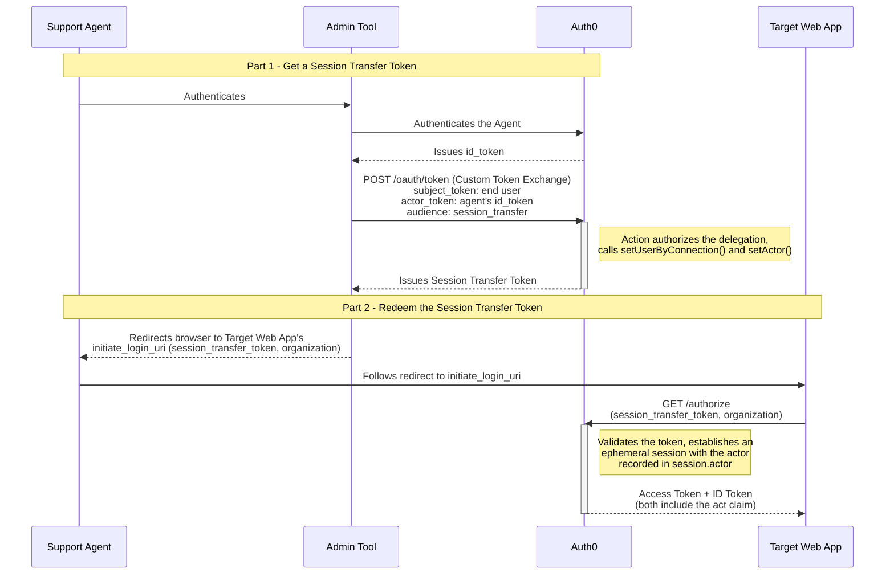

import { ReleaseStageNotice } from "/snippets/ja-jp/ReleaseStageNotice.jsx"

<ReleaseStageNotice feature="セッション委譲" stage="ea" plans="B2C Professional, B2B Professional, and Enterprise" terms="true" />

セッション委譲を使用すると、たとえばサポート担当者などの認可されたアクターが、アプリケーション内で別のユーザーとしてWebセッションを確立できます。[カスタムトークン交換](/docs/ja-jp/authenticate/custom-token-exchange) を基盤とし、主体ユーザーとアクターの両方を識別するSession Transfer Tokenを発行します。このトークンは、[ネイティブからWebへのSSO](/docs/ja-jp/authenticate/single-sign-on/native-to-web)と同じ仕組みでセッションに引き換えられます。委譲そのものはテナントログに記録され、監査できます。

<Callout icon="file-lines" color="#0EA5E9" iconType="regular">
  セッション委譲は、ネイティブからWebへのSSOとは異なる課題を解決します。ネイティブからWebへのSSOでは、すでに認証済みのユーザー自身のセッションを、ネイティブアプリケーションからWebアプリケーションへ引き継ぎます。一方、セッション委譲では、サポートアクセスや担当者支援ワークフローなどのユースケースで、別の認可済みアクターが**別のユーザーとして**セッションを確立できます。サインイン済みのユーザーをネイティブアプリからWebアプリへ移行する場合は、[ネイティブからWebへのSSO](/docs/ja-jp/authenticate/single-sign-on/native-to-web)を参照してください。
</Callout>

  ## 仕組み

セッション委譲は、2段階で行われます。まず管理者用アプリケーションが Session Transfer Token を取得し、その後、そのトークンを引き換えて、対象の Web アプリケーションで委譲されたセッションを確立します。

  ### パート 1: Session Transfer Token を取得する

1. アクター (サポート担当者) は、管理ツールを通じて Auth0 で認証を行い、`actor_token` として使用する Auth0 ID トークンなど、自身のアイデンティティを証明する情報を取得します。
2. 管理ツールは、`audience` を `urn:YOUR_AUTH0_TENANT_DOMAIN:session_transfer` に設定したカスタムトークン交換リクエストを使用して、Auth0 の [`/oauth/token`](/docs/ja-jp/api/authentication/custom-token-exchange/get-token) エンドポイントを呼び出します。
3. 関連付けられた[カスタムトークン交換 Action](/docs/ja-jp/customize/actions/explore-triggers/custom-token-exchange) が委譲を承認し、主体ユーザーを設定し (通常は `setUserByConnection()` を使用) 、`setActor()` を呼び出してアクターを記録します。Session Transfer Token を取得するには、`setActor()` を呼び出す必要があります。
4. Auth0 は、主体ユーザーを識別し、トランザクション内のアクターが記録された Session Transfer Token を発行します。

  ### パート 2: Session Transfer Token の引き換え (ブラウザーリダイレクト)

アプリケーションから対象の Web アプリケーションに Session Transfer Token を渡す方法は実装によって異なりますが、対象アプリケーションの `initiate_login_uri` にクエリパラメータとして付加する方法を推奨します。

5. アプリケーションは、Session Transfer Token と、organization のコンテキストでログインする必要がある場合は `organization` パラメータをクエリパラメータとして付加し、アクターのブラウザーを対象アプリケーションの `initiate_login_uri` にリダイレクトします。
6. これにより、Session Transfer Token を含むブラウザーが Auth0 テナントの `/authorize` エンドポイントに送られ、シームレスな引き換えが開始されます。Auth0 はトークンを検証し、主体ユーザーの一時的な委譲セッションを確立するとともに、監査用に `session.actor` にアクターを記録します。
7. 対象アプリケーションはログインを完了し、委譲を識別する `act` claim を含むアクセストークンと ID トークンを受け取ります。

リクエストとレスポンスの詳細、リダイレクトの構築方法、生成されたトークンの処理方法については、[Implement Session Delegation](/docs/ja-jp/authenticate/single-sign-on/session-delegation/implement-session-delegation) を参照してください。アプリケーションの [Configure Session Delegation](/docs/ja-jp/authenticate/single-sign-on/session-delegation/configure-session-delegation) 方法について確認し、セッションの動作と監査ログを理解するには、[Delegated Session Behavior and Monitoring](/docs/ja-jp/authenticate/single-sign-on/session-delegation/session-delegation-behavior-and-monitoring) を参照してください。

  ## 制限事項

* 委譲セッションの確立でサポートされるのは認可コードフローのみです。SAML、WS-Federation、およびImplicit Flowはサポートされていません。
* サポートされるアクターは単一レベルのみです。最大5レベルのネストされたアクターをサポートするカスタムトークン交換のアクセストークンとは異なり、Session Transfer Tokenで受け入れられるアクターは1つのみです。
* **委譲セッションにはリフレッシュトークンは発行されません。**
* MFA、同意、または登録プロンプトが必要な場合、委譲セッションは確立できません。プロンプトを表示する代わりに、リクエストは`interaction_required`で失敗します。