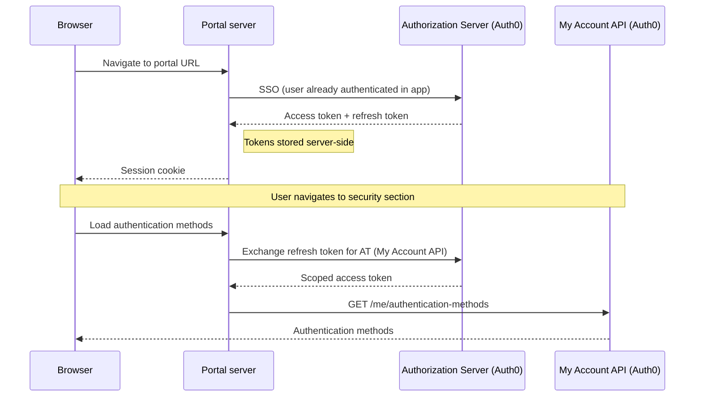
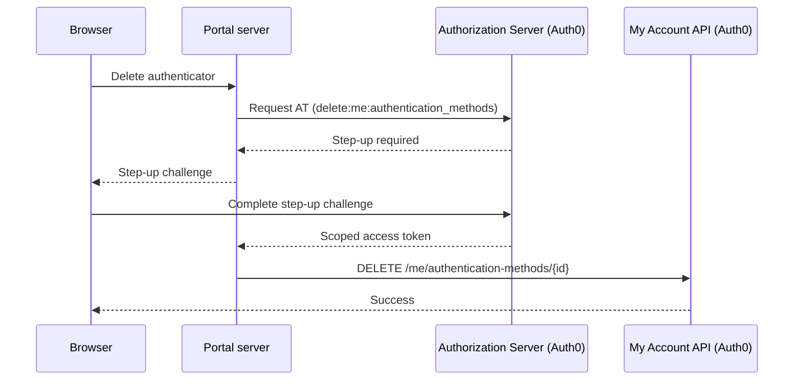
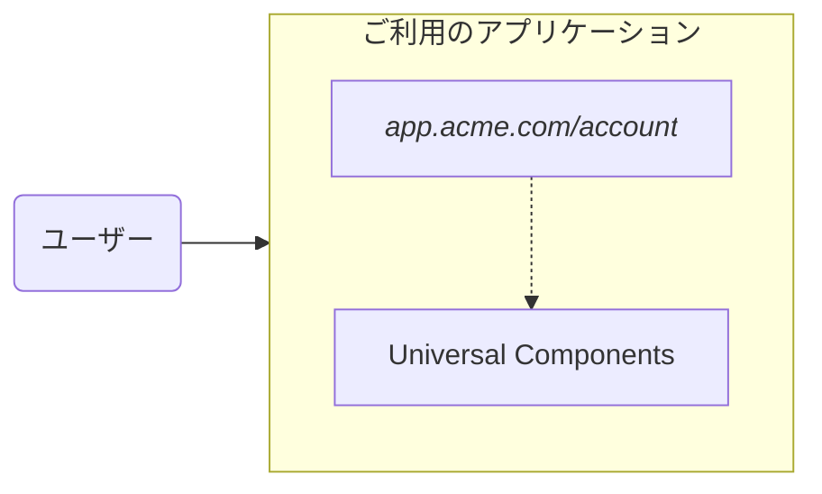
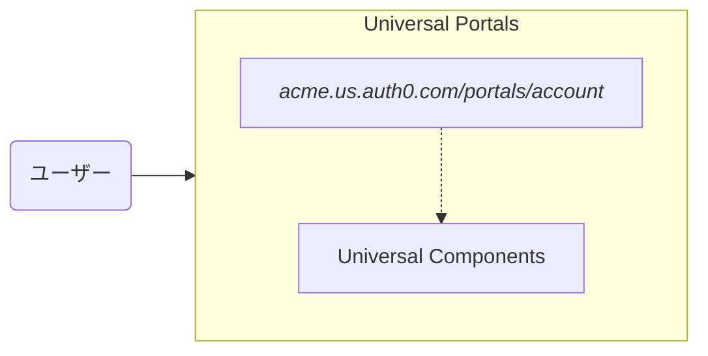

import { ReleaseStageNotice } from "/snippets/ja-jp/ReleaseStageNotice.jsx"

<ReleaseStageNotice feature="Auth0 Universal Portals" stage="beta" terms="true" contact="Auth0 Support" />

Auth0 Universal Portals は、ホスト型のアイデンティティエクスペリエンスプラットフォームです。プロファイル管理や organization の設定などを提供する、あらかじめ構築されたフルマネージドのポータルをデプロイできます。コードの記述、インフラストラクチャのホスティング、カスタム UI の保守は必要ありません。

Universal Portals では、個人設定用の [My Account API](/docs/ja-jp/api/myaccount) や organization 管理用の [My Organization API](/docs/ja-jp/api/myorganization) を使用して、Auth0 がホストするセルフサービスポータルを作成できます。

<Frame></Frame>

  ## ユースケース

Universal Portals は、次のユースケースに対応しています。

* エンドユーザーがアカウントのプロファイル管理、[多要素認証 (MFA) ](/docs/ja-jp/secure/multi-factor-authentication#multi-factor-authentication-mfa)の登録、パスワード変更、セキュリティ設定にアクセスできるセルフサービスの**コンシューマーポータル**を作成します。
  このユースケースは、すべてのアプリケーションで一から構築する**My Account**ページに代わるものです。

<Frame></Frame>

* organization のメンバーが organization の設定、ドメイン検証、チーム管理を行えるセルフサービスの**ビジネスポータル**を作成します。
  このユースケースは、すべての B2B アプリケーションで一から構築する**My Organization**ページに代わるものです。

<Frame></Frame>

  ## 主な機能

Universal Portals では、構築、設定、保守を行うことなく、次の機能を利用できます。

* **ビジュアルビルダー**: ドラッグ＆ドロップエディターでポータルページを設定できます。以下が含まれます。

  * **アイデンティティコンポーネント**: あらかじめ用意された [Universal Components](/docs/ja-jp/get-started/universal-components/universal-components-overview) を使用して、プロファイル管理、MFA の登録、パスワード変更、organization の設定を行えます。
  * **[Auth0 フォーム](/docs/ja-jp/customize/forms)**: ポータルページでフォームを使用し、プロファイルの更新、ポリシーへの同意、マーケティングコミュニケーションの受信設定など、エンドユーザーから情報を収集できます。
  * **レイアウトコンポーネント**: セクション、区切り線、その他の構造要素を追加して、ページを視覚的に構成できます。

* **ポータルとアプリケーション**: すべてのポータルは、Auth0 の [通常の Web アプリ](/docs/ja-jp/get-started/auth0-overview/create-applications/regular-web-apps#register-regular-web-applications) を基盤としています。
  * Auth0 Dashboard を使用してポータルを作成すると、Auth0 がアプリケーションを自動的に作成・設定し、コールバック、ログアウト URL、API Access、グラントもすべて自動的に設定されます。
  * これらのリソースは、Auth0 CLI または Management API を使用して手動でプロビジョニングし、ポータルの作成時にアプリケーションをリンクすることもできます。詳細については、[Universal Portals Quickstart](/docs/ja-jp/customize/portals/quickstart) を参照してください。

* **ブランディングの継承**: ポータルは tenant のブランディング設定、ロゴ、色、フォントを自動的に継承します。B2B シナリオでは、ブランディングは組織コンテキストに応じて適用されます。

* **インフラストラクチャ不要**: ポータルは Auth0 によって完全にホストされます。デプロイ、スケーリング、保守は必要ありません。

* **デフォルトのセキュリティ**: Universal Portals は、デフォルトでアイデンティティセキュリティのベストプラクティスを実装しています。

  * [**バックチャネルログアウト**](/docs/ja-jp/authenticate/login/logout/back-channel-logout): 別のデバイスからのログアウト、セッションの取り消し、アカウントの変更など、何らかの理由でセッションが終了すると、すべてのデバイスでポータルセッションが自動的に終了します。
  * **自動 MFA ステップアップ**: ユーザーが機密性の高い操作にアクセスすると、ポータルは認証チャレンジを透過的に処理し、成功した場合は元の操作を再試行します。

  ## 仕組み

Universal Portals では、認証済みのユーザーがアプリケーション内からポータルにアクセスできます。
ポータル URL にアクセスすると、ポータルサーバーで Auth0 の[シングルサインオン](/docs/ja-jp/authenticate/single-sign-on/inbound-single-sign-on)が実行されます。これはログインプロンプトを表示せずに透過的に行われます。

Auth0 は[アクセストークン](/docs/ja-jp/secure/tokens/access-tokens)と[リフレッシュトークン](/docs/ja-jp/secure/tokens/refresh-tokens)を発行し、これらはサーバー側に保存されます。ブラウザーが受け取るのは、暗号化された[session](/docs/ja-jp/manage-users/sessions) Cookie のみです。

ユーザーがセクション間を移動すると、ポータルサーバーはリフレッシュトークンを使用して、そのセクションで必要なリソースのみにスコープが設定された新しいアクセストークンを取得します。
login 時に発行されたリフレッシュトークンは、個人設定用の[My Account API](/docs/ja-jp/api/myaccount)や、organization 管理用の[My Organization API](/docs/ja-jp/api/myorganization)など、異なる audience 向けのアクセストークンと交換できます。

以下の図では、ユーザーが認証方法を管理するためにセキュリティセクションに移動しています。この操作には My Account API が必要です。

  ### ステップアップチャレンジ

一部の操作には、より高い保証レベルが求められます。ユーザーが、`delete:me:authentication_methods` スコープを必要とする[認証器の削除](/docs/ja-jp/api/myaccount/authentication-methods/delete-authentication-method)などの機密性の高い操作を試みると、Auth0はステップアップチャレンジが必要であることを示します。

Universal Portalsはこれを自動的に処理し、ステップアップチャレンジを表示します。ユーザーが完了すると、元の操作が再試行されます。

  ## Universal Portals と Universal Components

Universal Portals と [Universal Components](/docs/ja-jp/get-started/universal-components/universal-components-overview) は同じコンポーネントライブラリを使用していますが、提供主体が異なります。

* Universal Portals は完全にホスト型のエクスペリエンスを提供します。
* Universal Components は埋め込み型のエクスペリエンスを提供します。

|                 | **Universal Components (埋め込み)&#x20;**&#x20;| **Universal Portals (ホスト型)&#x20;**&#x20;|
| --------------- | ------------------------------------- | ---------------------------------- |
| **お客様の責任範囲**    | ホスティング、レイアウト、認証の連携、トークン管理             | ページコンテンツと設定                        |
| **エンドユーザーのフロー** | アプリ内で完結する                             | 別のポータル URL にリダイレクトされる              |
| **選択するケース**     | UX を完全に制御でき、リダイレクトが不要                 | 最も迅速にデプロイでき、管理するインフラストラクチャが不要      |

**Universal Components (埋め込み)&#x20;**

**Universal Portals (Hosted)&#x20;**

  ## 詳しく見る

<Card title="Universal Portals Quickstart" icon="gear" href="/docs/ja-jp/customize/portals/quickstart" horizontal>
  ポータルの設定と作成方法を学びます。
</Card>