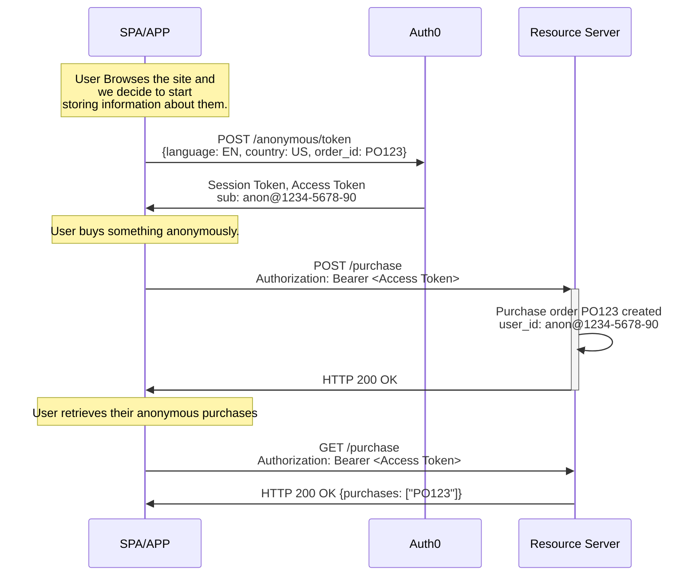
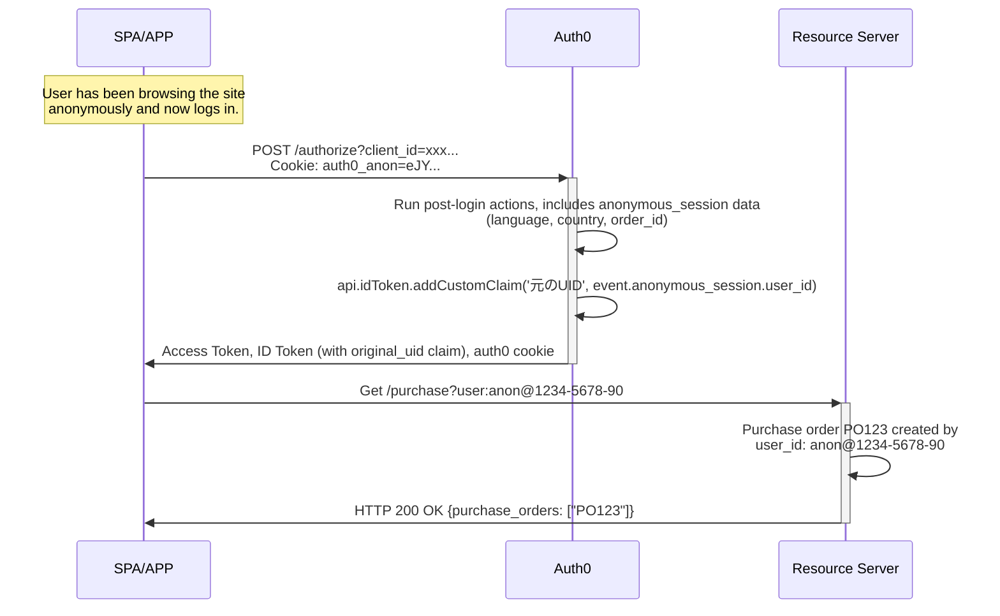

import { ReleaseStageNotice } from "/snippets/ja-jp/ReleaseStageNotice.jsx"

<ReleaseStageNotice feature="Anonymous Sessions" stage="beta" terms="true" contact="Auth0 Support" />

匿名セッションを使用すると、認証なしで[ユーザーセッション](/docs/ja-jp/manage-users/sessions)を作成・管理できます。

ユーザーは、アカウントを作成する前に、閲覧、カートやほしいものリストへの商品の追加、購入の完了、設定の指定を行えます。サインアップまたはログインすると、それまでのアクティビティが認証済みプロファイルに引き継がれます。

匿名セッションは、次のユースケースで使用できます。

* ページの読み込みやセッションをまたいで**ゲストユーザーを追跡する**
* ショッピングカートの参照情報、設定、同意、プロファイリング情報などの**メタデータを保存する**
* 認証なしでAPI呼び出し用の**アクセストークンを発行する**
* ユーザーがサインアップまたはログインした際に、**匿名でのアクティビティを認証済みアカウントに移行する**

<Warning>
  Auth0の匿名セッションのメタデータは安全なデータストアではないため、機密情報の保存には使用しないでください。
  これには、シークレットや社会保障番号、クレジットカード番号などの高リスクなPIIが含まれます。

  また、匿名セッションに保存されるデータは真実性や正確性が検証されていないため、鵜呑みにしないでください。

  Auth0のお客様には、メタデータに保存するデータを評価し、セッションのタグ付けおよびアクセス管理に必要なものだけを保存することを強く推奨します。
  詳細については、[Auth0 General Data Protection Regulation Compliance](/docs/ja-jp/secure/data-privacy-and-compliance/gdpr)をお読みください。&quot;
</Warning>

<div id="how-it-works">
  ## 仕組み
</div>

<div id="gather-anonymous-sessions-data">
  ### 匿名セッションのデータを収集する
</div>

まだ認証されていないユーザーも含め、ユーザーに関する情報の収集を開始すると、アプリケーションは `/anonymous/token` エンドポイントに `POST` リクエストを送信します。

Auth0 は2つのトークンを返します。

* 匿名セッションを識別し、維持するための [**セッショントークン**](/docs/ja-jp/secure/tokens/session-tokens)。
* ユーザーが [リソースサーバー (API) ](/docs/ja-jp/get-started/apis)に提示できる [**アクセストークン**](/docs/ja-jp/secure/tokens/access-tokens)。

セッショントークンを含む後続の呼び出しでは、同じ `user_id` のセッションが継続されるため、すべてのアクティビティを単一の起点にたどることができます。
アクセストークンを使用すると、匿名ユーザーは既存の任意の API を呼び出せます。



```json Anonymous session data of user anon@1234-5678-90
{
  "user_id": "anon@1234-5678-90",
  "session_id": "sess_456",
  "metadata": {
    "language": "EN",
    "country": "US",
    "purchase": "P0123"
  }
}
```

<div id="transfer-anonymous-sessions-data-to-users-metadata">
  ### 匿名セッションのデータをユーザーのメタデータに移行する
</div>

匿名セッション中のユーザーがログインまたは新規登録する際、アプリケーションはCookieまたはHTTPヘッダーを使用して、`anonymous_session_token`を`/authorize`エンドポイントに渡します。

```javascript cookie example
// 追加のコードは不要です。Cookie は自動的に送信されます
await auth0.loginWithRedirect();
```

```javascript authorize endpoint example
GET /authorize?
  client_id: YOUR_CLIENT_ID&
  redirect_uri: https://YOUR_ClIENT_URL/callback&
  response_type: code&
  scope: openid&
  Auth0-Anonymous-Session: eyJhbGciOiJkaXIiLCJlbmMiOiJBMjU2R0NNIn0...
```



Auth0 では、[`pre-user-registration`](/docs/ja-jp/customize/actions/explore-triggers/signup-and-login-triggers/pre-user-registration-trigger) および [`post-login`](/docs/ja-jp/customize/actions/explore-triggers/signup-and-login-triggers/login-trigger) の Actions トリガーで、`event.anonymous_session` オブジェクトを通じて匿名セッションデータを利用できます。

```json anonymous session object
{
  "anonymous_session": {
    "user_id": "anon@1234-5678-90",
    "session_id": "sess_123",
    "created_at": "2026-05-14T10:30:00Z",
    "metadata": {
      "language": "en",
      "country": "US",
      "order_id": "PO123"
    }
  }
}
```

Actions を使用した匿名セッションについて詳しくは、[匿名セッションのユースケース](/docs/ja-jp/manage-users/sessions/anonymous-sessions/anonymous-sessions-use-cases)をご覧ください。

<div id="end-the-anonymous-session-after-transfer">
  ### 転送後に匿名セッションを終了する
</div>

ユーザーが認証されても、匿名セッションは自動的に無効化されません。セッションを終了するには、`/anonymous/logout` エンドポイントを使用します。

```javascript wrap lines
// アプリケーションでのログイン成功後
if (wasAnonymousSession) {
  await fetch('https://YOUR_DOMAIN/anonymous/logout', {
    method: 'POST',
    headers: { 'Content-Type': 'application/json' },
    credentials: 'include', // Cookie を送信
    body: JSON.stringify({ client_id: 'YOUR_CLIENT_ID' }),
  });
}
```

<div id="best-practices">
  ## ベストプラクティス
</div>

匿名セッションに関するベストプラクティスは以下のとおりです。

* ユーザーの匿名セッションデータが失われないよう、適切な[匿名セッションの有効期間](/docs/ja-jp/manage-users/sessions/anonymous-sessions/configure-anonymous-sessions#configure-anonymous-sessions-in-your-auth0-tenant)を設定します。Auth0では、30日以上の有効期間を推奨しています。

* 攻撃者がセッションの内容を閲覧できないよう、匿名セッションの[JSON Web Encryption (JWE) ](/docs/ja-jp/manage-users/sessions/anonymous-sessions/configure-anonymous-sessions#configure-anonymous-sessions-in-your-auth0-tenant)暗号化を選択します。

* 匿名の`anon@`ユーザーがAPIで実行できる操作を制限します。

* トークンを検証し、メタデータをサニタイズします。サーバー側でバリデーションを行わずに、クライアントからのメタデータやトークンを決して信頼しないでください。

* [アクセストークン](/docs/ja-jp/secure/tokens/access-tokens)は有効期限まで再利用できるため、キャッシュします。

* [メタデータの更新](/docs/ja-jp/manage-users/sessions/anonymous-sessions/configure-anonymous-sessions#update-the-session-with-metadata)はまとめて行い、最小限に抑えます。メタデータを頻繁に更新しないでください。

<div id="limitations">
  ## 制限事項
</div>

* 匿名セッションでは、[パスワードリセット](/docs/ja-jp/customize/actions/explore-triggers/password-reset-triggers#password-reset-triggers)フローはサポートされていません。
* 認証リクエストと実際のログインが別のデバイスで行われるため、[デバイスコード](/docs/ja-jp/get-started/authentication-and-authorization-flow/device-authorization-flow)はサポートされていません。
* 認証リクエストと確認が別のデバイスで行われるため、[クライアント主導のバックチャネル認証 (CIBA)](/docs/ja-jp/get-started/applications/configure-client-initiated-backchannel-authentication)はサポートされていません。
* トランザクションの性質上 (たとえば、代理ログイン) 、匿名データが誤ったユーザーに関連付けられるおそれがあるため、[カスタムトークン交換](/docs/ja-jp/authenticate/custom-token-exchange/cte-example-use-cases)はサポートされていません。
* リフレッシュトークンを持つユーザーはすでにログイン済みであるため、匿名セッションでは[リフレッシュトークン交換](/docs/ja-jp/secure/call-apis-on-users-behalf/token-vault/configure-token-vault#configure-token-exchange)はサポートされていません。

<div id="learn-more">
  ## 詳細情報
</div>

* [匿名セッションを設定する](/docs/ja-jp/manage-users/sessions/anonymous-sessions/configure-anonymous-sessions) 匿名セッションの設定方法について説明します。
* [匿名セッションのユースケース](/docs/ja-jp/manage-users/sessions/anonymous-sessions/anonymous-sessions-use-cases) 匿名セッションのユースケースについて説明します。